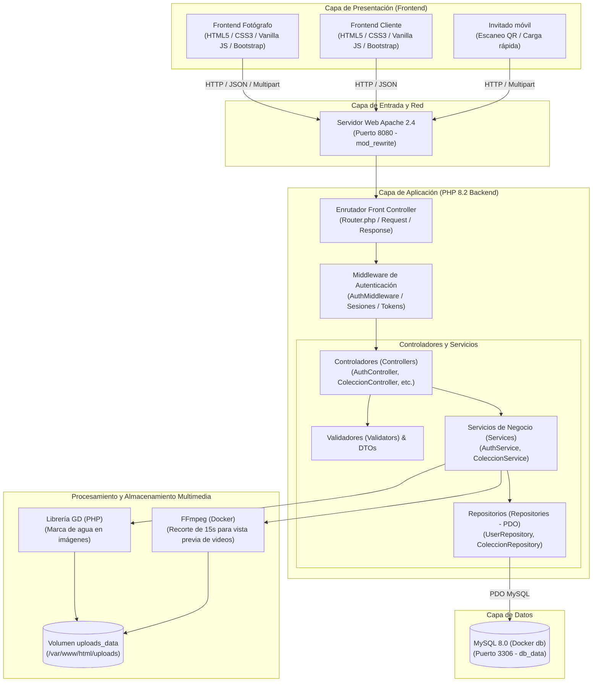
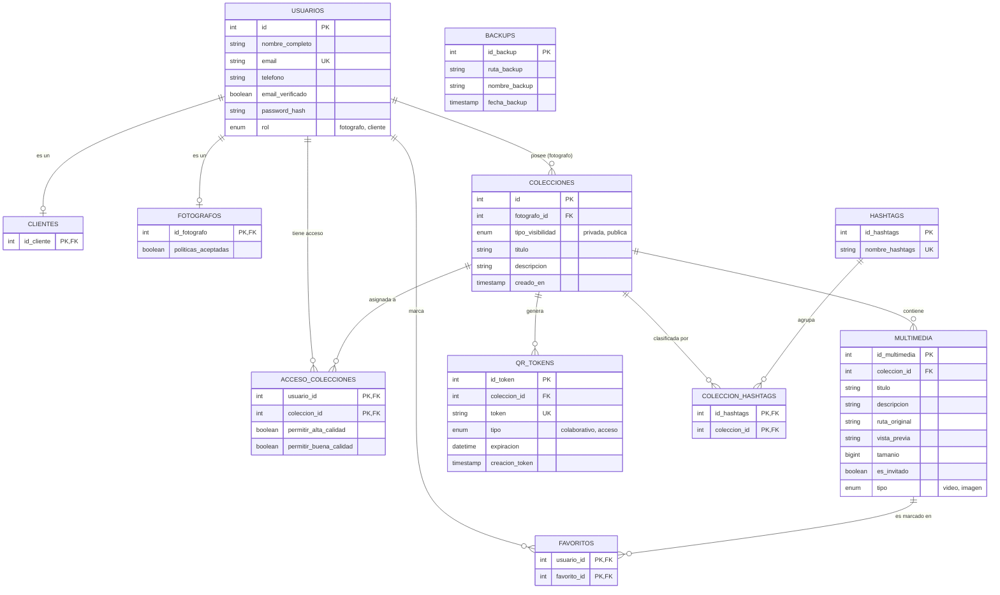
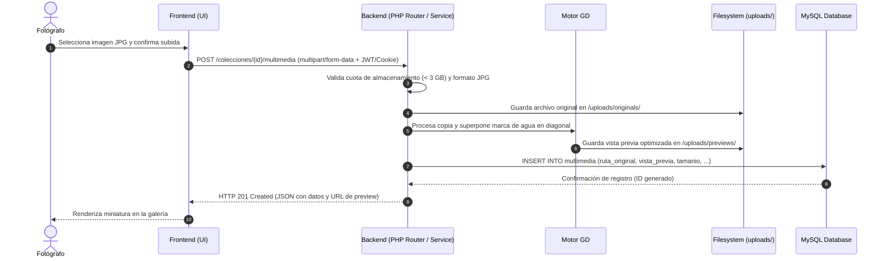
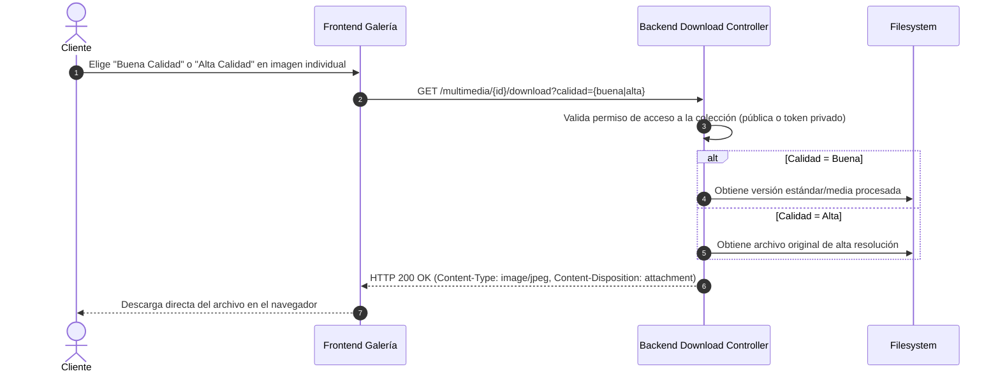

# 2. Arquitectura Propuesta, Modelado y Justificación Tecnológica

---

## 1. Arquitectura Propuesta del Sistema

El sistema **Cipher_Forge** adopta una **arquitectura en capas (Layered Architecture)** basada en el patrón **Cliente-Servidor desacoplado**, donde el frontend (interfaz de usuario) interactúa con el backend exclusivamente a través de una **API RESTful** sobre HTTP, persistiendo datos en un motor relacional y almacenando archivos multimedia en el sistema de archivos protegido del contenedor.

### 1.1 Diagrama de Arquitectura Global

### 1.2 Descripción de Capas

1. **Capa de Presentación (Frontend):**
   - Dividida en portales especializados según el rol de negocio: `frontend-fotografo` (gestión de colecciones, subida de medios, códigos QR y panel de moderación) y `frontend-cliente` (exploración de colecciones públicas, acceso privado por enlace y descarga directa individual).
   - Consumo asíncrono de la API mediante la API nativa `fetch` de JavaScript, procesando respuestas en formato JSON.

2. **Capa de Enrutamiento y Control de Acceso (Front Controller & Middleware):**
   - Apache redirige todas las peticiones entrantes hacia `public/index.php` utilizando `mod_rewrite`.
   - El componente `Router` despacha la solicitud hacia el controlador correspondiente basándose en el método HTTP (GET, POST, etc.) y la URI.
   - `AuthMiddleware` intercepta peticiones protegidas para validar autenticación y pertenencia de roles antes de ejecutar la lógica de negocio.

3. **Capa de Negocio y Dominio (Services, DTOs, Validators):**
   - **DTOs (Data Transfer Objects):** Encapsulan y tipan los datos de entrada evitando el manejo de arrays asociativos genéricos.
   - **Validators:** Verifican reglas de integridad (formatos de correo, complejidad de contraseña, tipos MIME de archivos y pesos máximos).
   - **Services:** Implementan las reglas de negocio (procesamiento de imágenes con marca de agua, generación de tokens QR con expiración, y reglas de cuota de 3 GB).

4. **Capa de Acceso a Datos (Repositories):**
   - Centraliza las consultas SQL hacia MySQL mediante `PDO` (PHP Data Objects).
   - Utiliza exclusivamente consultas preparadas (`prepared statements`) con vinculación de parámetros, mitigando ataques de inyección SQL (alineado con [04-seguridad.md](04-seguridad.md)).

5. **Capa de Almacenamiento y Procesamiento de Medios:**
   - **Librería GD:** Imprime marcas de agua diagonales sobre copias de previsualización de imágenes JPG en el momento de la subida.
   - **FFmpeg:** Genera un clip de 15 segundos para la vista previa del video, preservando el archivo original de hasta 800 MB para la descarga directa.
   - **Filesystem montado:** Almacenamiento persistente desacoplado en el volumen de Docker `uploads_data`.

---

## 2. Modelado de Datos (Diagrama Entidad-Relación)

La base de datos relacional en MySQL 8.0 estructura los datos del sistema implementando herencia de roles (tabla padre `usuarios` con extensiones `fotografos` y `clientes`), colecciones, recursos multimedia y control de seguridad.

### 2.1 Diagrama Entidad-Relación (Mermaid ERD)

### 2.2 Decisiones de Diseño en el Modelo

* **Jerarquía de Usuarios (Herencia de Tablas):** La tabla `usuarios` concentra las credenciales y atributos comunes (autenticación segura, verificación de correo, rol). Las tablas hijas `fotografos` y `clientes` referencian a `usuarios.id` con eliminación en cascada (`ON DELETE CASCADE`). Esto previene duplicidad de cuentas y permite escalar datos específicos de cada rol en fases futuras.
* **Separación de Original y Vista Previa:** En `multimedia`, se almacenan `ruta_original` (archivo de máxima resolución para descarga directa) y `vista_previa` (copia optimizada con marca de agua o clip de 15 segundos). La ruta original no se expone directamente en el cliente.
* **Tokens QR Efímeros vs Permanentes:** La tabla `qr_tokens` gestiona tanto el QR de carga colaborativa (con caducidad de 24 horas mediante el campo `expiracion`) como el enlace permanente de acceso a colecciones privadas.

---

## 3. Flujos de Información y Comunicación

### 3.1 Flujo de Subida y Procesamiento de Imágenes

### 3.2 Flujo de Descarga Directa en Dos Calidades (Post-CC-01)

Tras la decisión del equipo documentada en [08_control_de_cambios.md](08_control_de_cambios.md) (CC-01 y CC-02), se eliminó el ciclo de solicitudes por notificación:

---

## 4. Justificación Tecnológica

A continuación se fundamenta la selección de cada tecnología que compone el stack de **Cipher_Forge**, evaluando ventajas técnicas, viabilidad dentro del marco curricular de UTU y alternativas descartadas.

| Componente | Tecnología Seleccionada | Justificación Técnica | Alternativas Descartadas y Motivo |
| :--- | :--- | :--- | :--- |
| **Backend** | **PHP 8.2 (Vanilla OOP)** | Tipado estricto (`declare(strict_types=1)`), manejo robusto de excepciones, soporte nativo de extensiones para manipulación de streams y binarios. Curva de aprendizaje óptima para estudiantes y portabilidad sin dependencias externas pesadas. | **Node.js / Express:** Mayor complejidad en el manejo de streams binarios pesados en entornos locales sin colas dedicadas. **Laravel:** Sobrecarga de dependencias y magia sintáctica innecesaria para los requerimientos evaluables de UTU. |
| **Servidor Web** | **Apache 2.4 con mod_rewrite** | Compatibilidad nativa con PHP vía `mod_php` en la imagen oficial, estabilidad comprobada para redirección centralizada hacia Front Controller mediante `.htaccess` o configuración de VirtualHost. | **Nginx + PHP-FPM:** Excelente rendimiento, pero requiere configurar dos servicios o procesos independientes, aumentando la fricción de configuración en entorno local. |
| **Frontend** | **HTML5 Semántico, CSS3, Bootstrap 5 y Vanilla JavaScript** | Estructura accesible y limpia (HTML semántico), diseño adaptable e interactivo mediante Bootstrap 5 sin sobrecarga de frameworks, y JavaScript nativo moderno (ES6+, `fetch`, `async/await`) que garantiza comprensión línea por línea del código. | **React / Vue:** Requeriría tooling de compilación (Vite, Webpack, Node.js local), alejando el foco del proyecto de la lógica de negocio y arquitectura base. |
| **Base de Datos** | **MySQL 8.0** | Motor relacional estándar de la industria, soporte completo para integridad referencial (`FOREIGN KEY`, transacciones ACID), tipos ENUM para roles y estados, y funciones de agregación para cálculo de cuotas en bytes. | **PostgreSQL:** Prestaciones similares, pero MySQL ofrece mayor compatibilidad directa con las herramientas didácticas y el stack PHP habitual de UTU. **MongoDB:** Inadecuado por la naturaleza fuertemente relacional de permisos, colecciones y usuarios. |
| **Procesamiento de Video** | **FFmpeg en Contenedor** | Herramienta líder para transcodificación y extracción de recortes de video. Permite generar previews de 15 segundos sin saturar memoria RAM, aislando códecs en el contenedor Linux. | **Librerías JS en cliente:** Imposibilitadas de manejar archivos de 800 MB sin colapsar el navegador del cliente. |
| **Contenedores y Despliegue** | **Docker & Docker Compose** | Garantiza paridad absoluta entre los entornos de desarrollo de los tres integrantes del equipo y la mesa de evaluación de UTU. Una única orden (`docker compose up`) levanta backend, base de datos, extensiones y dependencias compiladas. | **XAMPP / WampServer local:** Problemas frecuentes de incompatibilidad de versiones de PHP/MySQL entre sistemas operativos Windows de los alumnos, además de carecer de FFmpeg preinstalado. |
