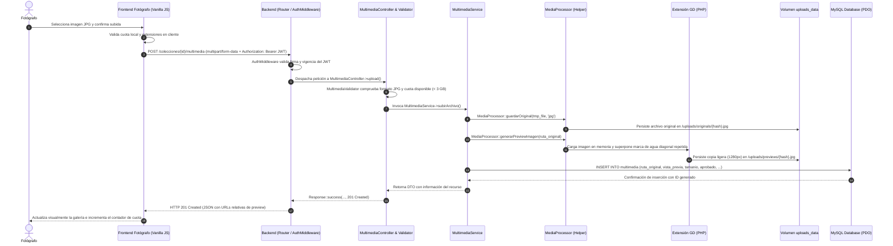
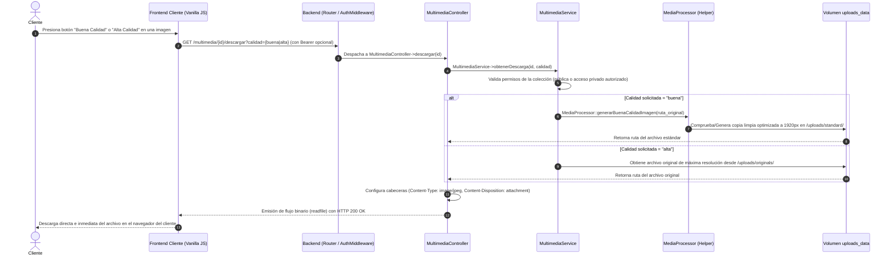

# 2. Arquitectura Propuesta, Modelado y Justificación Tecnológica

---

## 1. Arquitectura Propuesta del Sistema

El sistema **Cipher_Forge** adopta una **arquitectura en capas (Layered Architecture)** basada en el patrón **Cliente-Servidor desacoplado**, donde el frontend (interfaz de usuario) interactúa con el backend exclusivamente a través de una **API RESTful** sobre HTTP emitiendo y recibiendo cargas en formato JSON o binarios multipart. La persistencia de datos reside en un motor relacional MySQL 8.0 y los archivos multimedia se almacenan de forma estructurada en un volumen de almacenamiento persistente montado en el contenedor de la aplicación.

### 1.1 Diagrama de Arquitectura Global

```mermaid
graph TD
    subgraph Clientes ["Capa de Presentación (Frontend)"]
        FC["Frontend Fotógrafo\n(HTML5 Semántico / Vanilla CSS / Vanilla JS)"]
        FU["Frontend Cliente\n(HTML5 Semántico / Vanilla CSS / Vanilla JS)"]
        INV["Invitado móvil\n(HTML5 / Escaneo QR / Carga colaborativa)"]
    end

    subgraph Red ["Capa de Entrada y Servidor Web"]
        APACHE["Servidor Web Apache 2.4\n(Puerto 8080 - .htaccess a public/index.php)"]
    end

    subgraph Backend ["Capa de Aplicación (PHP 8.2 Backend Puro)"]
        ROUTER["Front Controller & Enrutador\n(public/index.php / Router.php / Request / Response)"]
        AUTH_MID["Middleware de Autenticación\n(AuthMiddleware / Validación Bearer JWT)"]
        
        subgraph Módulos ["Controladores, Validadores y Servicios"]
            CTRL["Controladores (Controllers)\n(AuthController, ColeccionController, MultimediaController,\nColaborativoController, FavoritoController, FotografoController, SistemaController)"]
            VAL["Validadores (Validators) & DTOs Inmutables\n(AuthValidator, RegisterDto, MultimediaDto, etc.)"]
            SERV["Servicios de Negocio (Services)\n(AuthService, ColeccionService, MultimediaService, BackupService)"]
            REPO["Repositorios de Persistencia (Repositories - PDO)\n(UserRepository, ColeccionRepository, MultimediaRepository)"]
        end

        subgraph HelpersNativos ["Helpers Nativos Especializados"]
            JWT_HELP["Jwt.php\n(Generación/Validación HS256 nativa)"]
            QR_HELP["QrGenerator.php\n(Matriz QR 25x25 SVG e HTML Imprimible)"]
            MEDIA_PROC["MediaProcessor.php\n(Gestión de archivos, marcas de agua y transcodificación)"]
        end
    end

    subgraph Multimedia ["Procesamiento y Almacenamiento Multimedia"]
        GD["Extensión GD (PHP 8.2)\n(Marca de agua diagonal repetida y redimensión Web)"]
        FFMPEG["FFmpeg CLI (Docker Debian)\n(Extracción de clips de 15s para vista previa)"]
        FS[("Volumen Docker uploads_data\n(/var/www/html/uploads)\n├── originals/\n├── previews/\n└── standard/")]
    end

    subgraph Persistencia ["Capa de Datos y Mantenimiento"]
        MYSQL[("MySQL 8.0 (Docker cipher_forge_db)\n(Puerto 3306 - volumen db_data)")]
        BACKUP["Sistema de Respaldos y Purga Diaria\n(worker cipher_forge_worker: cron-backup.php --loop / BackupService / PDO / rotación 3 copias)"]
    end

    FC -->|HTTP REST / JSON / Multipart| APACHE
    FU -->|HTTP REST / JSON| APACHE
    INV -->|HTTP REST / Multipart| APACHE
    
    APACHE --> ROUTER
    ROUTER --> AUTH_MID
    AUTH_MID --> CTRL
    CTRL --> VAL
    CTRL --> SERV
    SERV --> REPO
    
    SERV --> JWT_HELP
    SERV --> QR_HELP
    SERV --> MEDIA_PROC
    
    MEDIA_PROC --> GD
    MEDIA_PROC --> FFMPEG
    
    GD --> FS
    FFMPEG --> FS
    REPO -->|Conexión PDO / Sentencias preparadas| MYSQL
    BACKUP -.->|PDO SQL Dump y rotación automática| MYSQL
    BACKUP -.->|purgarExpirados (>24h) sobre| FS
```

### 1.2 Descripción Detallada de Capas

1. **Capa de Presentación (Frontend):**
   - **Estructura desacoplada:** Dividida en dos portales independientes según el rol del usuario: `frontend-fotografo` (gestión de colecciones, panel de subida con control de cuota de 3 GB, generación de códigos QR y moderación de invitados) y `frontend-cliente` (exploración de colecciones públicas por hashtags, favoritos, acceso privado por token y descarga directa en dos calidades).
   - **HTML5 Semántico:** Marcado riguroso utilizando elementos contextuales (`header`, `main`, `section`, `table`, `form`, `footer`) garantizando accesibilidad y una estructura de código limpia.
   - **Vanilla CSS3 (Sin frameworks externos):** Se descartó expresamente el uso de Bootstrap u otros frameworks CSS. La interfaz se construye con un sistema de diseño propio implementado mediante **Variables CSS (`:root`)** (paleta con acentos verde esmeralda inspirada en OBS Studio), **Flexbox** y **CSS Grid** para la distribución de tarjetas y galerías, cortes angulares con gradientes lineales (`linear-gradient(160deg, ...)`) y **Media Queries** nativas para adaptabilidad total (Responsive) en dispositivos móviles y de escritorio.
   - **Vanilla JavaScript:** Programación asíncrona mediante la API nativa `fetch` con `async/await`, manipulación directa del DOM sin intermediarios (sin jQuery ni frameworks SPA), almacenamiento local con `localStorage` (sesión del usuario, estado de la política de privacidad de la Ley 18.331 y caché de colecciones) y consumo de APIs estándar del navegador (`URLSearchParams`, `FileReader` para carga preliminar).

2. **Capa de Enrutamiento y Control de Acceso (Front Controller & Middleware):**
   - Apache redirige todas las peticiones entrantes hacia `public/index.php` utilizando la directiva `mod_rewrite` del archivo `.htaccess`.
   - **Autoloading PSR-4 nativo:** En `public/index.php`, una función `spl_autoload_register` mapea dinámicamente los namespaces bajo `App\` a la jerarquía física de `src/`, prescindiendo de Composer y evitando carpetas `vendor/` pesadas.
   - El componente `Router` inspecciona el método HTTP (GET, POST, PUT, DELETE) y la URI normalizada, despachando la ejecución al controlador correspondiente.
   - `AuthMiddleware` intercepta peticiones protegidas (`'auth'`) u opcionales (`'optional'`), validando el encabezado HTTP `Authorization: Bearer <token>` mediante tokens JWT firmados, rechazando peticiones no autorizadas con código `401 Unauthorized` antes de alcanzar los controladores.

3. **Capa de Negocio y Dominio (Services, DTOs, Validators & Helpers):**
   - **DTOs (Data Transfer Objects):** Clases inmutables con propiedades fuertemente tipadas (`readonly`) que estructuran la carga de datos (`RegisterDto`, `LoginDto`, `CreateColeccionDto`, `MultimediaDto`), garantizando la integridad de datos desde la entrada del sistema.
   - **Validators:** Clases especializadas (`AuthValidator`, `ColeccionValidator`, `MultimediaValidator`) que verifican reglas de negocio y restricciones técnicas (formatos RFC de correo electrónico, longitud de claves, extensiones MIME permitidas, límite de 800 MB en video y 3 GB en cuota global). Para que estos límites de aplicación sean los que efectivamente rigen, el runtime PHP del contenedor se alinea vía `php.ini` (`upload_max_filesize=900M`, `post_max_size=1G`, `memory_limit=512M`); antes, el default `2M` de PHP rechazaba fotos >2 MB en el transporte sin llegar al validador (CF-NUEVO/CC-15).
   - **Services:** Implementan la lógica de negocio nuclear (`AuthService`, `ColeccionService`, `MultimediaService`, `BackupService`), coordinando la persistencia con repositorios y la manipulación binaria con helpers.
   - **Helpers Nativos en PHP 8.2 (Sin librerías de terceros):**
     * `Jwt.php`: Generador y validador de tokens HS256 basado en `hash_hmac('sha256', ...)` y codificación Base64Url estándar.
     * `QrGenerator.php`: Algoritmo nativo que calcula la matriz modular QR (25x25 Versión 2) y genera directamente el código en formato vectorial SVG y plantillas HTML con estilos de impresión para eventos (HU4, HU7, HU17).
     * `MediaProcessor.php`: Centraliza la persistencia física de archivos, el cálculo de nombres criptográficos unívocos (`bin2hex(random_bytes(16))`), el estampado de marcas de agua con GD y la transcodificación de video con FFmpeg.

4. **Capa de Acceso a Datos (Repositories):**
   - Implementa el patrón Repository (`UserRepository`, `ColeccionRepository`, `MultimediaRepository`), aislando las sentencias SQL de la lógica de dominio.
   - Conexión relacional gestionada mediante `PDO` (`App\Core\Database`) en modo de reporte de errores `ERRMODE_EXCEPTION`.
   - Utilización estricta de consultas preparadas (`prepared statements`) con vinculación de parámetros tipados, erradicando cualquier vector de Inyección SQL.
   - Soporte transaccional ACID (`beginTransaction()`, `commit()`, `rollBack()`) en operaciones atómicas compuestas (como el registro de usuarios con tablas hijas o la eliminación de colecciones en cascada).

5. **Capa de Almacenamiento, Procesamiento Multimedia y Mantenimiento:**
   - **Librería GD:** Imprime marcas de agua semitransparentes en diagonal de forma repetida sobre copias de previsualización en JPG en el instante de la subida, redimensionando la imagen a un ancho óptimo de 1280 px para visualización rápida en galería. Para la descarga en "Buena Calidad", genera una copia limpia optimizada a un ancho máximo de 1920 px (Full HD).
   - **FFmpeg CLI en Docker:** Se ejecuta desde PHP mediante llamadas seguras por consola (`escapeshellarg`) sobre el binario preinstalado en el contenedor Linux, generando automáticamente un clip representativo de 15 segundos (`-t 15 -preset veryfast`) para la galería de previsualización, reteniendo el archivo original de hasta 800 MB para la descarga directa.
   - **Filesystem persistente:** Montaje desacoplado en el volumen de Docker `uploads_data`, organizado en los subdirectorios `/uploads/originals/`, `/uploads/previews/` y `/uploads/standard/`.
   - **Respaldos y Purga Automatizada (CF-12):** El servicio `worker` de docker-compose (`cipher_forge_worker`) ejecuta `cron-backup.php --loop` como proceso residente y desacoplado del tráfico web. Realiza (a) **respaldo diario** con `BackupService`: volcado DDL y DML de la base de datos vía PDO directo en `backend/backups/`, registro de la traza de auditoría en la tabla `backups` y rotación FIFO conservando estrictamente las últimas 3 copias (RNF5, RNF6, RNF7 / HU13); y (b) **purga horaria de colaborativos no aprobados > 24 h** (`MultimediaService::purgarExpirados`), borrando filas en `multimedia` y archivos físicos en `uploads/` (RF15 / HU12). Sus intervalos se configuran por entorno (`BACKUP_INTERVAL_SEG=86400`, `PURGE_INTERVAL_SEG=3600`); el controlador `SistemaController` ofrece las mismas tareas vía API (`POST /sistema/backup`, `POST /sistema/limpiar-colaborativos`).

---

## 2. Modelado de Datos (Diagrama Entidad-Relación)

La base de datos relacional MySQL 8.0 estructura la información del sistema garantizando integridad referencial estricta, restricciones unívocas y herencia de roles.

### 2.1 Diagrama Entidad-Relación (Mermaid ERD)

```mermaid
erDiagram
    USUARIOS ||--o| CLIENTES : "es un (hereda)"
    USUARIOS ||--o| FOTOGRAFOS : "es un (hereda)"
    USUARIOS ||--o{ COLECCIONES : "crea y administra"
    USUARIOS ||--o{ FAVORITOS : "marca"
    USUARIOS ||--o{ ACCESO_COLECCIONES : "tiene acceso asignado"
    
    COLECCIONES ||--o{ MULTIMEDIA : "contiene recursos"
    COLECCIONES ||--o{ QR_TOKENS : "emite tokens"
    COLECCIONES ||--o{ COLECCION_HASHTAGS : "clasificada en"
    COLECCIONES ||--o{ ACCESO_COLECCIONES : "asigna permisos a"
    
    HASHTAGS ||--o{ COLECCION_HASHTAGS : "asocia temas a"
    COLECCIONES ||--o{ FAVORITOS : "es marcada como favorita"

    USUARIOS {
        int id PK "Identificador único autoincremental"
        string nombre_completo "Nombre del usuario (máx 90 car)"
        string email UK "Correo único para login (máx 60 car)"
        string telefono "Teléfono de contacto opcional (máx 30 car)"
        boolean email_verificado "Estado de verificación de casilla"
        string codigo_verificacion "Código numérico temporal de validación"
        datetime codigo_expiracion "Fecha y hora límite del código"
        string password_hash "Contraseña hasheada con bcrypt"
        enum rol "Rol asignado: 'fotografo' o 'cliente'"
    }

    CLIENTES {
        int id_cliente PK,FK "Referencia a usuarios.id (ON DELETE CASCADE)"
        boolean politicas_aceptadas "Aceptación políticas/privacidad Ley 18.331 (registro, CF-15)"
    }

    FOTOGRAFOS {
        int id_fotografo PK,FK "Referencia a usuarios.id (ON DELETE CASCADE)"
        boolean politicas_aceptadas "Aceptación formal Ley 18.331"
    }

    COLECCIONES {
        int id PK "Identificador único autoincremental"
        int fotografo_id FK "Dueño de la colección (usuarios.id)"
        enum tipo_visibilidad "Visibilidad: 'privada' o 'publica'"
        string titulo "Título de la colección (máx 60 car)"
        string descripcion "Descripción del evento (máx 90 car)"
        timestamp creado_en "Fecha y hora de creación automática"
    }

    MULTIMEDIA {
        int id_multimedia PK "Identificador único autoincremental"
        int coleccion_id FK "Colección contenedora (colecciones.id)"
        string titulo "Título del recurso (máx 60 car)"
        string descripcion "Detalle del recurso (máx 90 car)"
        string ruta_original "Ruta del archivo original en disco"
        string vista_previa "Ruta de la vista previa procesada"
        bigint tamanio "Tamaño exacto del archivo original en bytes"
        boolean es_invitado "Indica si fue aportada vía QR por un invitado"
        boolean aprobado "Estado de moderación (TRUE aprobado, FALSE pendiente)"
        datetime consentimiento_ts "Consentimiento Ley 18.331 del invitado (nombre), CF-15"
        enum tipo "Tipo de recurso: 'video' o 'imagen'"
        timestamp creado_en "Fecha y hora de subida"
    }

    ACCESO_COLECCIONES {
        int usuario_id PK,FK "Usuario con acceso (usuarios.id)"
        int coleccion_id PK,FK "Colección asignada (colecciones.id)"
        boolean permitir_alta_calidad "Permiso de descarga original"
        boolean permitir_buena_calidad "Permiso de descarga media"
    }

    FAVORITOS {
        int usuario_id PK,FK "Usuario que marca (usuarios.id)"
        int favorito_id PK,FK "Colección pública marcada (colecciones.id)"
    }

    QR_TOKENS {
        int id_token PK "Identificador único autoincremental"
        int coleccion_id FK "Colección asociada (colecciones.id)"
        string token UK "Cadena alfanumérica única (máx 100 car)"
        enum tipo "Tipo de token: 'colaborativo' o 'acceso'"
        timestamp creacion_token "Fecha y hora de generación"
        datetime expiracion "Fecha de caducidad (24h para colaborativo, NULL para acceso)"
    }

    HASHTAGS {
        int id_hashtags PK "Identificador único autoincremental"
        string nombre_hashtags UK "Nombre unívoco del tag (máx 40 car)"
    }

    COLECCION_HASHTAGS {
        int id_hashtags PK,FK "Hashtag asociado (hashtags.id_hashtags)"
        int coleccion_id PK,FK "Colección vinculada (colecciones.id)"
    }

    BACKUPS {
        int id_backup PK "Identificador único autoincremental"
        string ruta_backup "Ruta del archivo .sql en disco"
        string nombre_backup "Nombre con marca de tiempo del backup"
        timestamp fecha_backup "Fecha y hora exacta del respaldo"
    }
```



### 2.2 Decisiones de Diseño en el Modelo

* **Jerarquía de Usuarios (Herencia de Tablas):** La tabla `usuarios` concentra las credenciales de acceso, la verificación por código y el rol. Las tablas especializadas `fotografos` (con la bandera de aceptación formal de la Ley 18.331 en primer login, HU31) y `clientes` (con el mismo consentimiento capturado en el registro, CF-15) referencian a `usuarios.id` con eliminación en cascada (`ON DELETE CASCADE`). Esta estructura elimina redundancias y garantiza que una cuenta no pueda duplicar su correo electrónico en roles simultáneos.
* **Separación de Archivo Original y Vista Previa:** La entidad `multimedia` mantiene dos rutas físicas diferenciadas: `ruta_original` (archivo fuente de máxima resolución, inaccesible directamente por URL para evitar robo de contenido) y `vista_previa` (copia optimizada con marca de agua semitransparente o videoclip de 15 segundos para la visualización en el navegador).
* **Ciclo de Vida y Moderación Colaborativa (RF14, RF15):** Los atributos `es_invitado` y `aprobado` en `multimedia` permiten que las cargas de invitados ingresen con `aprobado = FALSE`. El fotógrafo puede auditar estos archivos en su panel de moderación; los archivos no aprobados que superen las 24 horas desde `creado_en` son depurados automáticamente por la rutina del sistema.
* **Tokens QR Efímeros vs. Permanentes:** La entidad `qr_tokens` gestiona tanto el QR colaborativo de eventos (tipo `'colaborativo'`, con expiración a las 24 horas para subida anónima) como el QR de acceso permanente (tipo `'acceso'`, con expiración nula) que permite a clientes autorizados acceder a colecciones privadas.
* **Descarga Directa en Dos Calidades (Control de Cambios CC-01):** Conforme al Control de Cambios CC-01, se eliminó del modelo de base de datos la persistencia de solicitudes intermedias y notificaciones de autorización. La descarga opera de manera directa e individual en dos calidades ("Buena Calidad" reescalada a 1920 px y "Alta Calidad" original) mediante `GET /multimedia/{id}/descargar?calidad={buena|alta}`, simplificando el modelo relacional y optimizando la experiencia de usuario sin fricciones.

---

## 3. Flujos de Información y Comunicación

### 3.1 Flujo de Subida y Procesamiento de Imágenes

El siguiente diagrama detalla la secuencia exacta desde que el fotógrafo selecciona una imagen hasta que la vista previa con marca de agua queda disponible en la galería:



### 3.2 Flujo de Descarga Directa en Dos Calidades (Post-CC-01)

Conforme a las decisiones del equipo registradas en [08_control_de_cambios.md](08_control_de_cambios.md) (CC-01 y CC-02), la descarga opera de forma directa e individual sin requerir aprobación diferida:



---

## 4. Justificación Tecnológica

A continuación se fundamenta la selección técnica del stack de **Cipher_Forge**, analizando sus ventajas de arquitectura, la portabilidad del entorno y los motivos pedagógicos y técnicos por los cuales se descartaron tecnologías alternativas.

| Componente | Tecnología Seleccionada | Justificación Técnica | Alternativas Descartadas y Motivo |
| :--- | :--- | :--- | :--- |
| **Backend** | **PHP 8.2 (Vanilla OOP con PSR-4 nativo)** | Tipado estricto (`declare(strict_types=1)`), manejo robusto de excepciones y soporte nativo de extensiones para flujos de datos binarios y procesamiento de imágenes. Un autoloader PSR-4 escrito desde cero mediante `spl_autoload_register` garantiza portabilidad total y despliegue rápido sin requerir herramientas intermedias. | **Node.js / Express:** Mayor complejidad para el manejo eficiente de streams binarios pesados (imágenes de alta resolución y videos de hasta 800 MB) en entornos locales sin colas dedicadas.<br>**Laravel / Symfony:** Sobrecarga innecesaria de dependencias y falta de conocimientos tecnológicos para defenderlo ante los evaluadores de UTU. |
| **Servidor Web** | **Apache 2.4 con mod_rewrite** | Integración nativa con PHP vía `mod_php` en la imagen oficial de Docker, alta estabilidad y configuración directa mediante directivas en `.htaccess` para canalizar todas las rutas de la API hacia el Front Controller (`public/index.php`). | **Nginx + PHP-FPM:** Excelente desempeño en alta concurrencia, pero requiere administrar y coordinar dos procesos/contenedores separados, aumentando la fricción operativa durante las demostraciones locales del equipo. |
| **Frontend** | **HTML5 Semántico, Vanilla CSS y Vanilla JavaScript** | **HTML5 Semántico:** Estructuración accesible y limpia de la interfaz.<br>**Vanilla CSS:** Control milimétrico de la apariencia mediante Variables CSS (`:root`), Flexbox y Grid, evitando conflictos de especificidad o carga de estilos innecesarios.<br>**Vanilla JS:** Empleo nativo de `fetch`, Promesas, `async/await`, manipulación directa del DOM y `localStorage`, garantizando comprensión integral del código línea por línea sin intermediarios. | **Bootstrap 5 / Tailwind:** Descartados para evitar el peso muerto de hojas de estilo prefabricadas con clases genéricas y dependencias externas que restan mérito a la maquetación propia del equipo.<br>**React / Vue / Angular:** Requerirían un entorno de compilación adicional (Node.js, Vite, npm) que desvía el foco del proyecto de los fundamentos de red, seguridad y arquitectura cliente-servidor. |
| **Helpers Nativos (Seguridad y QR)** | **PHP Puro sin Composer (`Jwt.php` y `QrGenerator.php`)** | Máxima independencia tecnológica: la generación de tokens JWT HS256 mediante `hash_hmac` y la construcción de la matriz modular QR en SVG vectorial se programaron algorítmicamente en PHP puro, logrando un backend liviano, seguro y sin dependencias de paquetes externos. | **Librerías Composer (`firebase/php-jwt`, `endroid/qr-code`):** Descartadas para eliminar riesgos asociados a la cadena de suministros, evitar dependencias de Composer en la entrega y demostrar solvencia algorítmica ante UTU. |
| **Base de Datos** | **MySQL 8.0 Relacional** | Soporte estricto para transacciones ACID, integridad referencial (`FOREIGN KEY` con `ON DELETE CASCADE`), tipos ENUM para roles y visibilidad, y funciones de agregación para el cómputo exacto de cuotas de almacenamiento en bytes. | **PostgreSQL:** Prestaciones similares, pero MySQL ofrece mayor compatibilidad directa con las herramientas didácticas y el entorno curricular de UTU.<br>**MongoDB:** Descartado categóricamente debido a la naturaleza estrictamente relacional de las colecciones, permisos de usuario y auditoría de eventos. |
| **Procesamiento de Video** | **FFmpeg en Contenedor Docker** | Herramienta líder a nivel industrial para manipulación y transcodificación audiovisual. Permite recortar clips ligeros de 15 segundos sin saturar la memoria RAM del servidor web, aislando los códecs en la capa del contenedor Linux. | **Librerías JavaScript en el cliente:** Técnicamente incapaces de procesar videos de hasta 800 MB sin bloquear el hilo principal y saturar la memoria del navegador del usuario. |
| **Contenedores y Despliegue** | **Docker & Docker Compose** | Garantiza paridad absoluta e inmediata entre los entornos de desarrollo de los tres integrantes del equipo y la computadora de evaluación del tribunal de UTU. Un solo comando (`docker compose up`) levanta la base de datos, el servidor Apache con PHP 8.2 y los binarios de FFmpeg. | **Instalaciones locales con XAMPP / WampServer:** Fuente constante de conflictos por discrepancias entre versiones de PHP/MySQL en los sistemas Windows de los alumnos, sumado a la carencia de FFmpeg preinstalado. |
