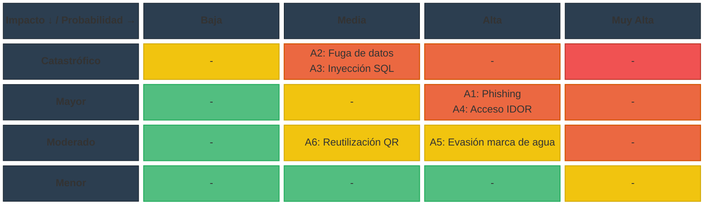

# Requerimientos de la Unidad Curricular: Ciberseguridad
**Proyecto de Egreso – BT 3° Tecnologías de la Información**
**Ana Victoria Reyes Macedo**

---

## Introducción

Cada grupo deberá integrar aspectos teóricos y prácticos de ciberseguridad
dentro del desarrollo de su Proyecto de Egreso. Esta integración no será un componente
adicional, sino una dimensión transversal que debe estar presente desde la planificación
inicial hasta la implementación y evaluación final del sistema.

Será evaluado tanto el uso efectivo de herramientas profesionales, como la
documentación técnica, el análisis crítico, la aplicación de buenas prácticas y la
reflexión ética. Cada entrega parcial contará con una calificación específica, y su
contenido deberá integrarse dentro del documento general del proyecto, siguiendo el
formato establecido.

---

# Primera Entrega – Análisis y Diseño Seguro


## Objetivo: Detectar amenazas desde la etapa inicial del proyecto y proponer mecanismos preventivos adecuados.


## 1. Identificación de al menos 3 amenazas digitales relevantes.

1.1 Phishing dirigido a fotógrafos y clientes

El sistema almacena datos de contacto (correo y teléfono) y gestiona el acceso a colecciones privadas y a la descarga de material pagado a futuro. Un atacante podría suplantar al sistema o al fotógrafo mediante correos falsos (por ejemplo, notificaciones falsas de "nueva colección disponible" o "verificación de cuenta") para robar credenciales de acceso. Dado que el rol Fotógrafo administra colecciones privadas y autoriza clientes manualmente, el robo de sus credenciales comprometería la confidencialidad de todo su material y de los datos de sus clientes.

1.2 Inyección SQL 

El sistema cuenta con múltiples formularios que interactúan con la base de datos: registro de usuarios (RF1, RF2), inicio de sesión (RF3), creación de colecciones (RF4), carga de metadatos de imágenes/videos (RF7, RF20) y validación de códigos QR (RF13-RF17). Si estas entradas no se validan ni se usan consultas parametrizadas, un atacante podría inyectar código SQL para leer, modificar o eliminar datos de usuarios, colecciones o permisos de descarga, representando un riesgo crítico dado que la base de datos contiene datos personales.

1.3 Fuga de datos personales

El RF1 dice que el sistema debe permitir registrar nombre completo, correo electrónico, contraseña y número de teléfono como opcional tanto de fotógrafos como de clientes. Una fuga de esta base de datos (por configuración insegura del entorno en la nube, respaldo mal protegido o error humano) expondría información de identificación personal, lo que además de un daño reputacional para el proyecto implicaría un problema legal y ético para el equipo, dado que se trata de datos sensibles de terceros.

1.4 Acceso no autorizado a colecciones privadas (IDOR)

Según RF5 y RF6, las colecciones privadas solo deben ser visibles para los clientes que el fotógrafo autorizó explícitamente, y el sistema debe bloquear el acceso directo por URL. Si la autorización se valida únicamente en el frontend, o si los identificadores de colección son predecibles y no se verifica en el backend que el usuario autenticado tenga permiso sobre ese recurso específico (vulnerabilidad de tipo IDOR — Insecure Direct Object Reference), cualquier usuario podría acceder a material privado de otro cliente simplemente cambiando un identificador en la URL.

1.5 Evasión de la marca de agua y descarga no autorizada

El modelo de negocio del cliente depende de que las imágenes en vista previa tengan marca de agua y que solo el contenido autorizado se entregue sin ella (restricción técnica confirmada en la entrevista, RF9, RF11). Si el archivo de alta calidad queda accesible por una URL directa no protegida, o si la marca de agua se aplica solo de forma visual sin proteger el archivo original en el servidor, un usuario podría descargar el material sin haber sido autorizado, afectando directamente el objetivo de negocio del cliente (cobro ágil por el material).

1.6 Abuso o reutilización de códigos QR

El sistema usa códigos QR con dos propósitos distintos: acceso directo a una colección (RF16) y carga colaborativa de contenido por parte de invitados sin cuenta (RF13, RF14). Si estos códigos no expiran, no están vinculados a un evento/colección específica o pueden reutilizarse indefinidamente, un tercero que obtenga el QR (por ejemplo, fotografiándolo en un evento) podría subir contenido no deseado a la colección o acceder a material privado fuera del contexto para el que fue generado.

---

## 2. Mapa de Riesgos

El siguiente esquema vincula los componentes principales del sistema con las amenazas identificadas, permitiendo visualizar qué partes del sistema concentran mayor exposición.


 
*Rojo = Impacto Alto (técnico y a usuarios) · Naranja = Impacto Medio*
 
---
 
## Escala de valoración de riesgo
 
| Nivel | Probabilidad | Impacto | Resultado (R) | Acción Inmediata |
|---|---|---|---|---|
| **Crítico** | Muy Alta (4-5) | Catastrófico (4-5) | 16 - 25 | Detener operaciones / Mitigación urgente |
| **Alto** | Alta (3) | Mayor (3) | 9 - 15 | Planes de acción correctiva a corto plazo |
| **Medio** | Media (2) | Moderado (2) | 4 - 8 | Monitoreo periódico y controles programados |
| **Bajo** | Baja (1) | Menor (1) | 1 - 3 | Asumir el riesgo / Monitoreo mínimo |
 
*R = Probabilidad × Impacto*
 
---
 
## Amenazas identificadas — valoración aplicada
 
Tabla construida a partir de las conexiones reales del Mapa de Riesgos (componentes del sistema → amenazas detectadas).
 
| Amenaza | Componente(s) afectado(s) | Probabilidad | Impacto | R | Nivel | Acción Inmediata |
|---|---|---|---|---|---|---|
| Phishing dirigido a fotógrafos y clientes | Registro e inicio de sesión de usuarios | Alta (3) | Mayor (3) | 9 | **Alto** | Planes de acción correctiva a corto plazo |
| Fuga de datos personales (contactos, nombres) | Base de datos de usuarios | Media (2) | Catastrófico (5) | 10 | **Alto** | Planes de acción correctiva a corto plazo |
| Inyección SQL en formularios y filtros | Base de datos de usuarios · Carga de imágenes y videos | Media (2) | Catastrófico (5) | 10 | **Alto** | Planes de acción correctiva a corto plazo |
| Acceso no autorizado a colecciones privadas (IDOR) | Gestión de colecciones · Acceso y carga vía código QR | Alta (3) | Mayor (3) | 9 | **Alto** | Planes de acción correctiva a corto plazo |
| Evasión de marca de agua / descarga no autorizada | Vista previa con marca de agua | Alta (3) | Moderado (2) | 6 | **Medio** | Monitoreo periódico y controles programados |
| Abuso o reutilización de códigos QR | Acceso y carga vía código QR | Media (2) | Moderado (2) | 4 | **Medio** | Monitoreo periódico y controles programados |

---
 
### Notas de justificación
 
- **Fuga de datos personales** e **Inyección SQL** se clasifican como Alto por su impacto catastrófico: ambas comprometen directamente la base de datos de usuarios, que contiene nombres completos, correos y teléfonos reales de fotógrafos y clientes.
- **Phishing** se clasifica como Alto por su alta probabilidad: es el vector de ataque más simple de ejecutar contra el punto de registro/inicio de sesión, sin requerir explotar una falla técnica del sistema.
- **Acceso no autorizado a colecciones privadas (IDOR)** se clasifica como Alto porque dos componentes distintos convergen en esta amenaza (Gestión de colecciones y Acceso vía QR), lo que aumenta su probabilidad de ocurrencia.
- **Evasión de marca de agua** y **Abuso de código QR** quedan en Medio: su impacto afecta principalmente el modelo de negocio del fotógrafo, pero su explotación depende de condiciones más puntuales (acceso al archivo original o al QR físico).

---
 
## Análisis de impacto (técnico y sobre los usuarios)
 
| Amenaza | Impacto técnico | Impacto sobre los usuarios |
|---|---|---|
| Phishing dirigido a fotógrafos y clientes | Robo de información; compromiso de cuentas de Fotógrafo o Cliente | Suplantación de identidad; pérdida de confianza en la plataforma |
| Fuga de datos personales (Contactos y Nombres) | Pérdida de confidencialidad del almacenamiento en la nube | Exposición de nombre completo, correo y teléfono de usuarios reales |
| Inyección SQL en formularios y filtros | Alteración o destrucción de datos; posible caída del servicio | Exposición de datos personales de todos los usuarios registrados |
| Acceso no autorizado a colecciones privadas (IDOR) | Bypass de la lógica de autorización del backend | Exposición de material privado de clientes y eventos ajenos |
| Evasión de marca de agua / descarga no autorizada | Acceso directo al archivo original sin control de permisos | Pérdida económica para el fotógrafo (afecta el objetivo de negocio) |
| Abuso o reutilización de códigos QR | Carga de contenido no controlado; acceso fuera del contexto previsto | Contenido indebido en la colección; exposición no deseada de material |

---

## 3. Buenas prácticas de seguridad en desarrollo web

Resumen las buenas prácticas durante el desarrollo, seleccionadas y justificadas en función de las amenazas concretas identificadas para este proyecto.

## 3.1 Validación y saneamiento de entradas

Todo dato ingresado por el usuario (formularios de registro, título/descripción de imágenes, parámetros de búsqueda) se validará y saneará tanto en el frontend como en el backend, y las consultas a la base de datos se realizarán mediante sentencias parametrizadas u ORM, nunca concatenando texto. Esta práctica ataca directamente el riesgo de inyección SQL (1.2) descrito arriba, que es crítico por la cantidad de formularios con los que cuenta el sistema.

---

## 3.2 Autenticación robusta y gestión segura de sesiones

Las contraseñas se almacenarán con un algoritmo de hash con salting (bcrypt), nunca en texto plano ni con hashes reversibles. Las sesiones utilizarán tokens con expiración y se invalidarán al cerrar sesión. Esta práctica reduce el impacto de un eventual phishing (1.1), ya que aunque se filtre un correo o usuario, la contraseña no queda expuesta directamente en la base de datos.


---

## 3.3 Control de acceso verificado en el backend (no solo en la interfaz)

Cada endpoint que devuelve una colección, imagen o dato de usuario deberá verificar en el servidor que el solicitante tiene permiso sobre ese recurso puntual, usando identificadores no predecibles (UUID en lugar de IDs incrementales) para colecciones privadas. Esta práctica es la respuesta directa al riesgo de acceso no autorizado.


---

## 3.4 Protección del archivo original frente a la vista previa

El archivo en alta calidad no se expondrá en ninguna ruta pública ni predecible: se servirá únicamente a través de un endpoint que valide el permiso de descarga del cliente en el momento de la solicitud (RF11, RF12), mientras que la vista previa con marca de agua se generará como una copia separada y optimizada (RF8, RF9). Esto protege el objetivo de negocio del cliente frente a la evasión de marca de agua (1.5).


---

## 3.5 Códigos QR con expiración

Cada código QR se generará como un token único asociado a una colección o evento específico, con fecha de expiración.

---

## 3.6 Registro y monitoreo de eventos sensibles

Se registrarán eventos como inicios de sesión fallidos y uso de códigos QR, lo que permitirá detectar patrones de abuso (por ejemplo, múltiples intentos de acceso a colecciones privadas).
---

## 7. Cambios a futuro (pendientes)

Cambios detectados en la auditoría del backend que quedan **documentados y postergados** por decisión del Product Owner. No se implementan en esta versión.

### 7.1 Protección de endpoints de administración `/sistema/*` (CF-08 / CC-14)

**Estado actual:** `POST /sistema/backup`, `GET /sistema/backups` y `POST /sistema/limpiar-colaborativos` (`routes.php`) son públicos: cualquiera que alcance la API puede disparar respaldos, listar el historial o **purgar colaborativos pendientes de cualquier fotógrafo**. El esquema solo admite roles `fotografo`/`cliente` (no existe `admin`).

**Cambio a futuro (postergado):** proteger estos endpoints **antes de exponer el servicio**. Opción recomendada: exigir cabecera `Authorization: Bearer <clave>` contra una clave maestra configurada por entorno (`SISTEMA_API_KEY`, con fallback y documentación de despliegue); alternativa: agregar rol `admin` al ENUM `roles` con usuario sembrado y verificación de rol en `AuthMiddleware`. El servicio `worker` y `cron-backup.php` **no se ven afectados** por ninguna de las dos, porque invocan `BackupService`/`MultimediaService` directamente (sin pasar por HTTP).

# Segunda Entrega - Implementación Segura, Criptografía y Aspectos Legales

# Términos y Condiciones

Estos términos definen el uso aceptable de la plataforma web, protegen al equipo de desarrollo/empresa y establecen cómo se gestionan los datos en cumplimiento con la normativa uruguaya.

## 1. Identificación y aceptación
* **Datos del presentador:** La plataforma es un sistema web destinado a fotógrafos y compradores de material fotográfico, desarrollado inicialmente como un Proyecto de Egreso de UTU. 
* **Consentimiento expreso:** Los usuarios (fotógrafos y clientes) deben aceptar de forma obligatoria los Términos y Condiciones y la Política de Privacidad al momento de registrarse. Además, en su primer inicio de sesión, el fotógrafo debe aceptar mediante un modal obligatorio su responsabilidad legal sobre el contenido y el cumplimiento de la Ley 18.331.

## 2. Uso aceptable y restricciones
* **Reglas de conducta:** El sistema permite la subida de imágenes en formato JPG y videos en formato MP4. Los invitados a un evento pueden subir fotos y videos mediante un código QR de carga colaborativa, pero el fotógrafo es quien debe moderar y aprobar este material. 
* **Gestión de cuentas:** Para registrarse, los usuarios deben proporcionar su nombre completo, correo electrónico y contraseña, con el número de teléfono como dato opcional. El sistema prohíbe y bloquea el registro de usuarios duplicados que intenten usar un mismo correo electrónico. Se requiere verificar la cuenta mediante un código enviado al correo electrónico.

## 3. Propiedad, estructura y contenidos
* **Dependencia de la plataforma:** El sistema ofrece galerías de previsualización donde las imágenes se muestran con una marca de agua aplicada automáticamente para proteger el trabajo del fotógrafo. Los videos subidos generan automáticamente un recorte de vista previa de un máximo de 15 segundos.
* **Contenido generado por el usuario:** El fotógrafo es quien decide de manera soberana si sus colecciones son públicas o privadas. El fotógrafo asume la total responsabilidad legal por el contenido que publica en la plataforma. La plataforma establece explícitamente que no se hace responsable ante posibles demandas por la publicación no autorizada de imágenes de terceros.

## 4. Aspectos económicos y cancelación
* **Precios y pagos:** El sistema otorga a cada fotógrafo una cuota de almacenamiento inicial de 3 GB. En esta primera versión del proyecto (por restricciones institucionales), no se incluyen pasarelas de pago reales ni se procesan cobros financieros dentro del sistema. 
* **Suspensiones:** El sistema controla activamente el límite de almacenamiento de 3 GB. Si el usuario supera esta cuota, el sistema impide nuevas subidas de archivos y notifica sobre los elementos que exceden el límite. Los archivos colaborativos subidos por invitados que no sean aprobados por el fotógrafo serán eliminados automáticamente luego de 24 horas.

## 5. Responsabilidad y legislación
* **Limitación de responsabilidad:** El sistema bloqueará cualquier intento de acceso directo mediante URL a las colecciones privadas por parte de usuarios no autorizados. Para mitigar el riesgo de pérdida de datos, el sistema realiza respaldos automáticos diarios de la base de datos.
* **Ley aplicable y jurisdicción:** La plataforma y el tratamiento de los datos personales se rigen estrictamente por la Ley 18.331 de Protección de Datos Personales de Uruguay. No se solicita la dirección física ni la cédula de identidad de los usuarios para simplificar el registro y minimizar la recolección de datos sensibles.

---

# Políticas de Seguridad de la Información (PSI)

Estas políticas establecen los lineamientos normativos para proteger la Confidencialidad, Integridad y Disponibilidad (CIA) de los datos gestionados en el sistema de fotografía.

## 1. Diagnóstico
* **Información sensible:** La organización maneja datos personales como nombres completos, correos electrónicos y contraseñas de los usuarios registrados. También gestiona material multimedia sensible y privado, perteneciente a eventos sociales (bodas, fiestas de 15 años).
* **Riesgos que enfrenta:** Se identificaron riesgos operativos como la caída del servidor, posibles pérdidas de información (respaldos), y el riesgo legal por exposición de material fotográfico privado sin autorización.

## 2. Definición de roles y responsabilidades
* **Fotógrafo (Administrador de colección):** Es responsable de clasificar sus colecciones como públicas o privadas. También es responsable de moderar y aprobar el material subido por los invitados a través del QR colaborativo.
* **Cliente:** Responsable de acceder a las colecciones privadas únicamente a través de los enlaces de invitación proporcionados, requiriendo registro o inicio de sesión.
* **Invitados (Carga colaborativa):** Pueden subir contenido de forma anónima mediante el código QR sin necesidad de registro, pero tienen restringido el acceso para visualizar o descargar otros archivos de la colección.

## 3. Lineamientos y normas
* **Confidencialidad:** Las colecciones privadas conservan su estado permanentemente, sin importar el tiempo transcurrido o la cantidad de clientes asignados. Se aplican marcas de agua a las imágenes en la vista previa para proteger la propiedad intelectual antes de la descarga o compra.
* **Disponibilidad e Integridad:** El sistema debe ejecutar un respaldo automático diario de la base de datos. Se aplica una política de rotación automática que mantiene almacenadas únicamente las últimas tres copias de seguridad. Queda registrado en el sistema la fecha y hora exacta de cada uno de estos respaldos.

## 4. Aprobación y difusión
* Las normativas de seguridad, términos de uso y el cumplimiento de la Ley 18.331 deben ser presentadas y aprobadas formalmente por el cliente solicitante, Lemuel Swec.
* Para la difusión a los usuarios, la política se comunica obligatoriamente a través de un modal emergente durante el primer inicio de sesión del fotógrafo.

## 5. Revisión periódica
* Las políticas actuales están diseñadas para un entorno de pruebas local como parte del proyecto académico. 
* Estas normativas deberán ser revisadas y actualizadas cuando el sistema se migre a un servidor en la nube de producción y se implementen pasarelas de métodos de pago reales en futuras versiones.


# Reporte de Análisis SAST — Cipher_Forge / Gestion-fotografias

**Herramienta:** SonarQube (Community Build) + SonarScanner CLI
**Tipo de verificación:** Static Application Security Testing (SAST) + análisis de calidad de código
**Proyecto:** `cipher-forge` — `C:\Users\Iván Sandoval\Desktop\Cipher_Forge\Gestion-fotografias`

---

## 1. Resumen ejecutivo

Se realizó un análisis SAST completo sobre el proyecto `Gestion-fotografias` (backend PHP/MySQL + frontends web JS/HTML/CSS + Docker) mediante SonarQube. Se detectaron **145 problemas activos**, de los cuales **7 son vulnerabilidades de seguridad**, **9 son bugs** y **129 son code smells**. El Quality Gate quedó en **ERROR** por cobertura nueva 0% (exigido ≥80%), duplicación nueva 9.35% (máx. 3%) y 102 incumplimientos nuevos.

No se encontraron **Security Hotspots** con probabilidad de vulnerabilidad, ni secretos expuestos (regla de texto y secretos analizó 84 archivos sin hallazgos).

**Prioridad de remediación:** corregir primero las 7 vulnerabilidades (CORS permissivo, PRNG no criptográfico para generación de IDs, cookies de sesión sin flags de seguridad y contenedor corriendo como *root*).

---

## 2. Información de la verificación

| Parámetro | Valor |
|:---|:---|
| Fecha del análisis | 2026-09-10 |
| SonarQube Server | `http://localhost:9000` (Community Build **26.8.0.126808**) |
| SonarScanner CLI | **8.1.0.6389** — Java 21.0.11 (Eclipse Adoptium) |
| Clave de proyecto | `cipher-forge` |
| Directorio base | `C:\Users\Iván Sandoval\Desktop\Cipher_Forge\Gestion-fotografias` |
| Dashboard | http://localhost:9000/dashboard?id=cipher-forge |
| Estado del análisis | `ANALYSIS SUCCESSFUL` (procesamiento Compute Engine: `SUCCESS`) |

---

## 3. Alcance del análisis

### 3.1 Archivos escaneados (82 archivos de código fuente)

| Lenguaje | Archivos | Notas |
|:---|:---:|:---|
| PHP | 37 | Backend `backend/src`, `public/`, scripts raíz (`routes.php`, `cron-backup.php`, probes) |
| JavaScript | 21 | Lógica de `frontend-cliente/js` y `frontend-fotografo/js` |
| HTML | 15 | Páginas de ambos frontends |
| CSS | 7 | Hojas de estilo de ambos frontends |
| INI | 1 | `backend/php.ini` (config runtime) |
| Dockerfile | 1 | `backend/Dockerfile` |

También se analizaron como parte del paso de texto/secretos: 84 archivos (incluye `docker-compose.yml` YAML, `routes.php`, etc.) con sensor `TextAndSecretsSensor`; **0 secretos encontrados**.

### 3.2 Configuración utilizada (`sonar-project.properties`)

```properties
sonar.projectKey=cipher-forge
sonar.projectName=Cipher Forge - Gestion Fotografias
sonar.projectVersion=1.0
sonar.sources=backend,frontend-cliente,frontend-fotografo
sonar.sourceEncoding=UTF-8
sonar.exclusions=backend/backups/**,backend/uploads/**,**/.git/**
```

### 3.3 Comando de ejecución (Windows / PowerShell)

```
& C:\Sonar-Scanner\sonar-scanner\bin\sonar-scanner.bat --% `
  -Dsonar.host.url=http://localhost:9000 `
  -Dsonar.token=<SONAR_TOKEN>
```

### 3.4 Perfiles de calidad activados

`Sonar way` para los 6 lenguajes detectados: **css, docker, js (JavaScript), php, web (HTML), yaml**.

> Nota: el análisis SCA de dependencias fue omitido (no hay manifiestos composer/npm en el proyecto) y no se proveyeron reportes de cobertura (PHPUnit/JS), por lo que `coverage = 0.0%`.

---

## 4. Métricas globales (proyecto `cipher-forge`)

| Métrica | Valor |
|:---|:---|
| Líneas de código (NCLOC) | 10 499 |
| Líneas totales | 13 655 |
| Sentencias | 4 027 |
| Funciones | 672 |
| Clases | 32 |
| Complejidad | 1 765 |
| Densidad de comentarios | 6.6% |
| **Problemas totales (activos)** | **145** |
| Vulnerabilidades | 7 |
| Bugs | 9 |
| Code Smells | 129 |
| Security Hotspots | 0 |
| Cobertura de código | 0.0% |
| Duplicación | 4.3% |
| Rating de seguridad | **C (3.0)** |
| Rating de fiabilidad | **C (3.0)** |
| Rating de mantenibilidad | **A (1.0)** |

### 4.1 Distribución por severidad

| Severidad | Cantidad |
|:---|:---:|
| Blocker | 0 |
| Critical | 20 |
| Major | 52 |
| Minor | 71 |
| Info | 2 |
| **Total** | **145** |

### 4.2 Quality Gate

| Condición | Valor real | Umbral | Estado |
|:---|:---|:---|:---|
| Cobertura nueva (`new_coverage`) | 0.0% | ≥ 80% | ❌ ERROR |
| Duplicación nueva (`new_duplicated_lines_density`) | 9.35% | ≤ 3% | ❌ ERROR |
| Violaciones nuevas (`new_violations`) | 102 | = 0 | ❌ ERROR |

**Estado global del Quality Gate: `ERROR`**

---

## 5. Vulnerabilidades de seguridad (7)

Listado resumido:

| # | Severidad | Regla | Archivo | Línea |
|:--|:--|:--|:--|:--:|
| V1 | Major | `javascript:S2245` PRNG no seguro | `frontend-fotografo/js/subirimagenes.js` | 309 |
| V2 | Major | `javascript:S2245` PRNG no seguro | `frontend-fotografo/js/collection.js` | 8 |
| V3 | Major | `javascript:S2245` PRNG no seguro | `frontend-fotografo/js/subirimagenes.js` | 27 |
| V4 | Major | `php:S5122` CORS permissivo | `backend/public/index.php` | 54 |
| V5 | Minor | `php:S3330` Cookie sin HttpOnly | `backend/php.ini` | — |
| V6 | Minor | `php:S2092` Cookie sin `secure` | `backend/php.ini` | — |
| V7 | Minor | `docker:S6471` Contenedor como root | `backend/Dockerfile` | 3 |

### V1, V2, V3 — Generadores de números pseudoaleatorios (PRNG) en contexto sensible — `javascript:S2245`

**Regla:** *"Pseudorandom number generators (PRNGs) should not be used in security contexts"* (CWE-338: Use of Cryptographically Weak PRNG).

**Código afectado:**
```javascript
// collection.js:8 y subirimagenes.js:27
id: Date.now() + Math.random(),

// subirimagenes.js:309 (generación de id por cada archivo subido)
const id = Date.now() + Math.random();
```

**Justificación:** `Math.random()` implementa un PRNG no criptográfico (secuencia determinista/predecible). Si el valor resultante se usa como identificador de recursos, un atacante podría predecir y correlacionar IDs (por ejemplo, adivinar IDs de colecciones o de archivos subidos). Los PRNG no criptográficos **no** deben usarse para generar secretos, tokens, nonces ni identificadores con valor de control de acceso.

**Cómo corregir:** usar un generador criptográficamente seguro (`CSPRNG`):
```javascript
const cripto = window.crypto || window.msCrypto;
const buffer = new Uint32Array(1);
cripto.getRandomValues(buffer);
const id = Date.now() + buffer[0];
```
Alternativa recomendada en este contexto: dejar que el backend genere IDs de colecciones/medios (autoincremental o UUID) y no depender de `Math.random()` en el cliente.

### V4 — Política CORS excesivamente permisiva — `php:S5122`

**Regla:** *"Cross-Origin Resource Sharing (CORS) policy should be restricted to trusted origins"* (CWE-942: Overly Permissive Cross-domain Whitelist).

**Código afectado (`backend/public/index.php:54`):**
```php
header('Access-Control-Allow-Origin: *');
```

**Justificación:** `Access-Control-Allow-Origin: *` permite que **cualquier** sitio web origen realice peticiones cross-origin y lea las respuestas de la API (incluyendo datos sensibles de colecciones y sesiones con `Authorization`). Permite exfiltración de datos si la API expone recursos autenticados.

**Cómo corregir:** restringir a una lista blanca de orígenes confiables:
```php
$origin = $_SERVER['HTTP_ORIGIN'] ?? '';
$permitidos = ['https://dominio-cliente.ejemplo', 'https://dominio-fotografo.ejemplo'];
if (in_array($origin, $permitidos, true)) {
    header('Access-Control-Allow-Origin: ' . $origin);
    header('Vary: Origin');
}
```

### V5 — Cookie de sesión sin flag `HttpOnly` — `php:S3330`

**Regla:** *"Cookies should have the 'HttpOnly' flag"* (CWE-1004: Sensitive Cookie Without 'HttpOnly' Attribute).

**Código afectado (`backend/php.ini`):** no se define `session.cookie_httponly`.

**Justificación:** con `HttpOnly` desactivado, un script JavaScript inyectado vía XSS puede leer `document.cookie` y robar el `PHPSESSID`, permitiendo secuestro de sesión. La cookie de sesión es altamente sensible.

**Cómo corregir:** habilitarla por defecto en PHP 8.2:
```ini
session.cookie_httponly = 1
```

### V6 — Cookie de sesión sin flag `secure` — `php:S2092`

**Regla:** *"Cookies should have the 'secure' flag"* (CWE-614: Sensitive Cookie in HTTPS Session Without 'Secure' Attribute).

**Código afectado (`backend/php.ini`):** no se define `session.cookie_secure`.

**Justificación:** sin `secure`, la cookie de sesión se envía también por HTTP sin cifrar y puede ser interceptada en un ataque de intermediario (man-in-the-middle), exponiendo la sesión del usuario.

**Cómo corregir:** en producción (servida sobre HTTPS):
```ini
session.cookie_secure = 1
```

> ⚠️ Nota: `session.cookie_secure = 1` descarta la cookie si la app se accede por HTTP plano (como `http://localhost:8080` en desarrollo). Si se habilita, el sitio debe servirse siempre por HTTPS.

### V7 — Imagen Docker ejecutándose como usuario privilegiado — `docker:S6471`

**Regla:** *"Docker containers should not run as a privileged user"*.

**Código afectado (`backend/Dockerfile:3`):**
```dockerfile
FROM php:8.2-apache
```

**Justificación:** las imágenes Docker se ejecutan como `root` por defecto si no se define `USER`. Si la aplicación (o Apache/PHP) se compromete, el atacante obtiene privilegios **root** dentro del contenedor, ampliando el impacto de cualquier vulnerabilidad.

**Cómo corregir:** crear y usar un usuario no privilegiado:
```dockerfile
FROM php:8.2-apache
RUN useradd --create-home --uid 1000 www-app
USER www-app
```
> O especificar usuario no-root en `docker run --user` o en el `docker-compose.yml` (`user:`).

---

## 6. Bugs (9)

Listado de bugs activos (errores de código que pueden causar comportamiento incorrecto):

| # | Severidad | Regla | Archivo | Línea | Detalle | Acción |
|:--|:--|:--|:--|:--:|:--|:--|
| B1 | Major | `Web:InputWithoutLabelCheck` | `frontend-cliente/pages/panelcliente.html` | 47 | Input sin `<label>` asociado | Añadir `<label for="...">` |
| B2 | Major | `javascript:S4822` | `frontend-fotografo/js/binarios.js` | 38 | Promesa dentro de `try` sin `await`/`.catch()`, su rechazo no se maneja | Usar `await` o encadenar `.catch()` |
| B3 | Major | `javascript:S4822` | `frontend-fotografo/js/binarios.js` | 48 | Ídem | Ídem |
| B4 | Major | `javascript:S4822` | `frontend-fotografo/js/binarios.js` | 63 | Ídem | Ídem |
| B5 | Minor | `php:S2003` | `backend/probe_media.php` | 2 | `require` puede incluir el archivo dos veces | Usar `require_once` |
| B6 | Minor | `php:S2003` | `backend/probe_media.php` | 3 | Ídem | Ídem |
| B7 | Major | `Web:InputWithoutLabelCheck` | `frontend-fotografo/pages/SubirImagenes.html` | 34 | Input sin `<label>` | Añadir label |
| B8 | Major | `Web:InputWithoutLabelCheck` | `frontend-fotografo/pages/SubirImagenes.html` | 72 | Ídem | Ídem |
| B9 | Major | `Web:InputWithoutLabelCheck` | `frontend-fotografo/pages/login.html` | 32 | Ídem | Ídem |

Detalle de reglas:

- **`Web:InputWithoutLabelCheck`** — Los campos `input`/`select`/`textarea` deben tener `<label>`. Sin etiquetas, la accesibilidad (WCAG 3.3.2 / 4.1.2) se degrada y herramientas de asistencia no pueden anunciar el propósito del campo.
- **`javascript:S4822`** — *"Promise rejections should not be caught by 'try' blocks"*. Una promesa lanzada dentro de un bloque `try` sin `await` ni `.catch()` genera un rechazo no manejado que puede romper el flujo de subida de binarios.
- **`php:S2003`** — *"require_once/include_once should be used instead of require/include"*. `require`/`include` no evitan la doble inclusión → definiciones duplicadas y errores fatales en scripts de sondeo.

---

## 7. Code Smells (129)

Problemas de mantenibilidad agrupados por regla. Todos son de tipo `CODE_SMELL`.

| Regla | Cant. | Descripción | Archivos afectados |
|:--|:--:|:--|:--|
| `javascript:S6582` | 31 | Preferir *optional chaining* (`?.`) en lugar de accesos encadenados | `gallery.js` (4), `panel.js` (4), `api.js` (6), `subirimagenes.js` (8), `panelcliente.js` (3), `tuscoleccionescliente.js` (3), `almacenamiento.js`, `qracceso.js`, `qrcolaborativo.js` |
| `php:S113` | 14 | Los archivos deben terminar en salto de línea | 14 archivos PHP (`FavoritoController`, `QrGenerator`, `Mailer`, `index.php`, `routes.php`, `Router.php`, probes, `AuthController`, `AuthService`, dtos, validators, `HomeController`) |
| `css:S7924` | 11 | Contraste insuficiente entre texto y fondo (accesibilidad) | `panelcliente.css` (4), `tuscolecciones.css` (3), `panel.css` (3), `colaborativo.css` |
| `php:S1192` | 7 | Literales de texto duplicados → definir constantes | `MultimediaService.php` (2), `cron-backup.php`, `routes.php`, `ColaborativoController.php`, `ColeccionService.php`, `MultimediaValidator.php` |
| `Web:S6819` | 7 | Usar etiqueta semántica nativa en lugar de rol ARIA | `SubirImagenes.html` (2), `login.html`, `panel.html`, `registro.html`, `verificaremail.html`, `editarperfil.html` |
| `javascript:S2486` | 7 | Excepciones capturadas e ignoradas | `api.js` (2), `script.js` (2), `subirimagenes.js` (2), `auth.js` |
| `php:S3776` | 7 | Complejidad cognitiva muy alta (refactorizar) | `QrGenerator.php` (3), `AuthMiddleware.php`, `Mailer.php`, `Router.php`, `MultimediaValidator.php` |
| `javascript:S7785` | 6 | Preferir *top-level await* sobre cadenas de promesas | `subirimagenes.js` (4), `moderation.js`, `colaborativo.js` |
| `php:S1142` | 4 | Demasiadas sentencias `return` en una función | `QrGenerator.php`, `AuthMiddleware.php`, `Mailer.php`, `Jwt.php` |
| `javascript:S7765` | 3 | Usar `.includes()` en lugar de `.indexOf()` | `subirimagenes.js` (2), `tuscoleccionescliente.js` |
| `php:S112` | 3 | Lanzar excepciones genéricas en lugar de dedicadas | `QrGenerator.php` (2), `Mailer.php` |
| `javascript:S3776` | 3 | Complejidad cognitiva alta | `subirimagenes.js` (2), `panel.js` |
| `javascript:S7758` | 2 | Usar métodos string conscientes de Unicode (`codePointAt`/`fromCodePoint`) | `subirimagenes.js` (2) |
| `php:S121` | 2 | Estructuras de control sin llaves `{}` | `ColeccionRepository.php`, `BackupService.php` |
| `php:S1135` | 2 | Comentarios `TODO` sin completar | `MultimediaValidator.php`, `Request.php` |
| `javascript:S7781` | 2 | Usar `replaceAll()` en lugar de `replace()` con regex global | `script.js` |
| `Web:S6850` | 2 | Encabezados sin contenido accesible | `tuscoleccionescliente.html`, `colaborativo.html` |
| `css:S4666` | 2 | Selectores duplicados | `panelcliente.css`, `tuscolecciones.css` |
| `php:S1131` | 1 | Espacios en blanco al final de línea | `Database.php` |
| `Web:S7926` | 1 | Meta viewport deshabilita zoom (`user-scalable=no`) | `colaborativo.html` |
| `javascript:S6594` | 1 | Preferir `RegExp.exec()` sobre `String.match()` | `tuscoleccionescliente.js` |
| `php:S1448` | 1 | Clase con demasiados métodos (28 > 20) | `QrGenerator.php` |
| `docker:S7031` | 1 | Fusionar instrucciones `RUN` consecutivas | `Dockerfile` |
| `php:S127` | 1 | Condición de parada de bucle `for` no invariante | `QrGenerator.php` |
| `php:S1172` | 1 | Parámetro de función sin uso | `MultimediaService.php` |
| `javascript:S3504` | 1 | Usar `let`/`const` en lugar de `var` | `panel.js` |
| `javascript:S7756` | 1 | Usar `Blob.arrayBuffer()` en vez de `FileReader` | `subirimagenes.js` |
| `javascript:S7721` | 1 | Mover función a alcance exterior | `subirimagenes.js` |
| `javascript:S1940` | 1 | Chequeo booleano invertido | `subirimagenes.js` |
| `javascript:S1481` | 1 | Variable/función sin usar | `tuscoleccionescliente.js` |
| `javascript:S7776` | 1 | Arrays usados solo para comprobar existencia → usar `Set` | `panelcliente.js` |
| `javascript:S3358` | 1 | Ternario anidado | `subirimagenes.js` |

---

## 8. Security Hotspots

**Resultado: 0 hotspots** de seguridad pendientes de revisión. No hay código que requiera triaje manual de exposición (por ejemplo, usos de `eval`, `exec`, SSRF, deserialización, etc.).

---

## 9. Resumen por lenguaje y origen de los hallazgos

| Lenguaje | Vulnerabilidades | Bugs | Code Smells |
|:--|:--:|:--:|:--:|
| PHP | 3 | 2 | ≈ 45 |
| JavaScript | 3 | 3 | ≈ 56 |
| HTML (Web) | 0 | 4 | ≈ 12 |
| CSS | 0 | 0 | ≈ 15 |
| Docker | 1 | 0 | 1 |
| INI (php.ini) | 2 | 0 | 0 |

> Los conteos por lenguaje de code smells son aproximados (basados en el agrupamiento por regla y archivos), totalizando 129.

---

## 10. Archivos escaneados (listado completo)

### Backend (40 archivos)
```
backend/cron-backup.php
backend/Dockerfile
backend/index.html
backend/php.ini
backend/probe_media.php
backend/probe_originals.php
backend/public/index.php
backend/routes.php
backend/src/Core/Config.php
backend/src/Core/Database.php
backend/src/Core/Request.php
backend/src/Core/Response.php
backend/src/Core/Router.php
backend/src/controllers/AuthController.php
backend/src/controllers/ColaborativoController.php
backend/src/controllers/ColeccionController.php
backend/src/controllers/FavoritoController.php
backend/src/controllers/FotografoController.php
backend/src/controllers/HomeController.php
backend/src/controllers/MultimediaController.php
backend/src/controllers/SistemaController.php
backend/src/dtos/CreateColeccionDto.php
backend/src/dtos/LoginDto.php
backend/src/dtos/MultimediaDto.php
backend/src/dtos/RegisterDto.php
backend/src/helpers/Jwt.php
backend/src/helpers/Mailer.php
backend/src/helpers/MediaProcessor.php
backend/src/helpers/QrGenerator.php
backend/src/middlewares/AuthMiddleware.php
backend/src/repository/ColeccionRepository.php
backend/src/repository/MultimediaRepository.php
backend/src/repository/UserRepository.php
backend/src/services/AuthService.php
backend/src/services/BackupService.php
backend/src/services/ColeccionService.php
backend/src/services/MultimediaService.php
backend/src/validators/AuthValidator.php
backend/src/validators/ColeccionValidator.php
backend/src/validators/MultimediaValidator.php
```

### Frontend cliente (16 archivos)
```
frontend-cliente/css/colaborativo.css
frontend-cliente/css/estiloscliente.css
frontend-cliente/css/panelcliente.css
frontend-cliente/js/api.js
frontend-cliente/js/auth.js
frontend-cliente/js/colaborativo.js
frontend-cliente/js/favoritoscliente.js
frontend-cliente/js/gallery.js
frontend-cliente/js/panelcliente.js
frontend-cliente/js/tuscoleccionescliente.js
frontend-cliente/js/utils.js
frontend-cliente/pages/colaborativo.html
frontend-cliente/pages/favoritoscliente.html
frontend-cliente/pages/panelcliente.html
frontend-cliente/pages/tuscoleccionescliente.html
```

> Nota: `frontend-cliente/pages/logincliente.html` y `frontend-cliente/pages/registrocliente.html` existían en la primer corrida pero ya no están en disco; sus issues del análisis anterior quedaron en estado `CLOSED`.

### Frontend fotógrafo (26 archivos)
```
frontend-fotografo/css/estilos.css
frontend-fotografo/css/moderacion.css
frontend-fotografo/css/panel.css
frontend-fotografo/css/tuscolecciones.css
frontend-fotografo/index.html
frontend-fotografo/js/almacenamiento.js
frontend-fotografo/js/binarios.js
frontend-fotografo/js/collection.js
frontend-fotografo/js/editarperfil.js
frontend-fotografo/js/menu-perfil.js
frontend-fotografo/js/moderation.js
frontend-fotografo/js/panel.js
frontend-fotografo/js/qracceso.js
frontend-fotografo/js/qrcolaborativo.js
frontend-fotografo/js/script.js
frontend-fotografo/js/subirimagenes.js
frontend-fotografo/js/verificaremail.js
frontend-fotografo/pages/crearcoleccion.html
frontend-fotografo/pages/editarperfil.html
frontend-fotografo/pages/login.html
frontend-fotografo/pages/moderacion.html
frontend-fotografo/pages/panel.html
frontend-fotografo/pages/registro.html
frontend-fotografo/pages/SubirImagenes.html
frontend-fotografo/pages/verificaremail.html
```

> Nota: `frontend-fotografo/pages/prototipo.html`, `frontend-fotografo/pages/tuscolecciones.html`, `frontend-fotografo/js/favoritos.js` y `frontend-fotografo/gestionar-invitador-QR/*` existían en la primer corrida pero ya no están en disco; sus issues quedaron en estado `CLOSED`.

> ⚠️ Diferencias con la primer corrida: el análisis comparó 2 revisiones del código. Los issues con estado `CLOSED` (186 en total buscados vs 145 activos) corresponden a archivos que fueron eliminados/renombrados o líneas corregidas entre análisis (ej. `pages/prototipo.html`, `Routers.php`, `css/descarga.css`, `css/editarperfil.css`, `css/global.css`, `css/qr.css`, `frontend-fotografo/js/favoritos.js`, `collection.js`, etc.).

---

## 11. Correlación con estándares de seguridad

| Vulnerabilidad | CWE | Mitigación relacionada |
|:--|:--|:--|
| `S2245` (PRNG no seguro) | CWE-338 | OWASP — Uso de funciones criptográficas débiles |
| `S5122` (CORS permisivo) | CWE-942 | OWASP API Security — Cross-Origin Listado de dominio confiable |
| `S3330` (sin HttpOnly) | CWE-1004 | Mitigación de XSS / robo de cookies |
| `S2092` (sin secure) | CWE-614 | Prevenir sniffing de sesión (MITM) |
| `S6471` (usuario root) | — | Principio de menor privilegio (AWS Well-Architected / CIS Docker) |

---

## 12. Notas metodológicas y limitaciones

1. **Análisis estático** (SAST): detecta patrones en el código fuente sin ejecutarlo. No sustituye a tests funcionales, DAST ni revisión manual.
2. **Falsos positivos posibles**: p. ej., `S2245` marca `Math.random()` usado para *IDs locales*; aunque los IDs se generen con PRNG débil, el impacto real depende de si los expone a un token de sesión/permisos. Se recomienda revisión manual por parte del equipo.
3. **Cobertura 0%**: no se adjuntaron reportes de pruebas. El Quality Gate de cobertura quedará en ERROR hasta configurar `sonar.php.coverage.reportPaths` / `sonar.javascript.lcov.reportPaths`.
4. No se encontraron dependencias gestionadas (Sin composer.json / package.json), por lo que no hay análisis SCA de bibliotecas vulnerables en este run.
5. El token del escáner debería revocarse al finalizar las verificaciones (Account → Security, `http://localhost:9000/account/security`).

---

## 13. Comandos de reproducción

```powershell
# 1) Levantar SonarQube (segundo plano)
Start-Process -FilePath "cmd.exe" -ArgumentList "/c",
  "C:\SonarQube\sonarqube\sonarqube-26.8.0.126808\bin\windows-x86-64\StartSonar.bat" -WindowStyle Hidden

# 2) Esperar estado UP
Invoke-WebRequest http://localhost:9000/api/system/status

# 3) Ejecutar análisis
& "C:\Sonar-Scanner\sonar-scanner\bin\sonar-scanner.bat" --% `
  -Dsonar.host.url=http://localhost:9000 -Dsonar.token=<SONAR_TOKEN>
```

---

*Reporte generado automáticamente a partir de los datos exportados de SonarQube (análisis del 2026-09-10). Fuente de reglas: repositorio SonarSource SonarQube Community Build 26.8.*


