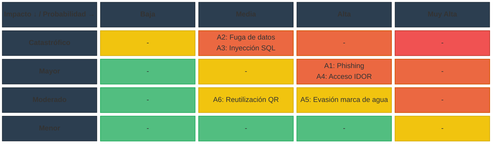

# Requerimientos de la Unidad Curricular: Ciberseguridad
**Proyecto de Egreso – BT 3° Tecnologías de la Información**
**Ana Victoria Reyes Macedo**

---

## Introducción

Cada grupo deberá integrar aspectos teóricos y prácticos de ciberseguridad
dentro del desarrollo de su Proyecto de Egreso. Esta integración no será un componente
adicional, sino una dimensión transversal que debe estar presente desde la planificación
inicial hasta la implementación y evaluación final del sistema.

Será evaluado tanto el uso efectivo de herramientas profesionales, como la
documentación técnica, el análisis crítico, la aplicación de buenas prácticas y la
reflexión ética. Cada entrega parcial contará con una calificación específica, y su
contenido deberá integrarse dentro del documento general del proyecto, siguiendo el
formato establecido.

---

# Primera Entrega – Análisis y Diseño Seguro

## Objetivo: Detectar amenazas desde la etapa inicial del proyecto y proponer mecanismos preventivos adecuados.

## 1. Identificación de al menos 3 amenazas digitales relevantes.

1.1 Phishing dirigido a fotógrafos y clientes

El sistema almacena datos de contacto (correo y teléfono) y gestiona el acceso a colecciones privadas y a la descarga de material pagado a futuro. Un atacante podría suplantar al sistema o al fotógrafo mediante correos falsos (por ejemplo, notificaciones falsas de "nueva colección disponible" o "verificación de cuenta") para robar credenciales de acceso. Dado que el rol Fotógrafo administra colecciones privadas y autoriza clientes manualmente, el robo de sus credenciales comprometería la confidencialidad de todo su material y de los datos de sus clientes.

1.2 Inyección SQL 

El sistema cuenta con múltiples formularios que interactúan con la base de datos: registro de usuarios (RF1, RF2), inicio de sesión (RF3), creación de colecciones (RF4), carga de metadatos de imágenes/videos (RF7, RF20) y validación de códigos QR (RF13-RF17). Si estas entradas no se validan ni se usan consultas parametrizadas, un atacante podría inyectar código SQL para leer, modificar o eliminar datos de usuarios, colecciones o permisos de descarga, representando un riesgo crítico dado que la base de datos contiene datos personales.

1.3 Fuga de datos personales

El RF1 dice que el sistema debe permitir registrar nombre completo, correo electrónico, contraseña y número de teléfono como opcional tanto de fotógrafos como de clientes. Una fuga de esta base de datos (por configuración insegura del entorno en la nube, respaldo mal protegido o error humano) expondría información de identificación personal, lo que además de un daño reputacional para el proyecto implicaría un problema legal y ético para el equipo, dado que se trata de datos sensibles de terceros.

1.4 Acceso no autorizado a colecciones privadas (IDOR)

Según RF5 y RF6, las colecciones privadas solo deben ser visibles para los clientes que el fotógrafo autorizó explícitamente, y el sistema debe bloquear el acceso directo por URL. Si la autorización se valida únicamente en el frontend, o si los identificadores de colección son predecibles y no se verifica en el backend que el usuario autenticado tenga permiso sobre ese recurso específico (vulnerabilidad de tipo IDOR — Insecure Direct Object Reference), cualquier usuario podría acceder a material privado de otro cliente simplemente cambiando un identificador en la URL.

1.5 Evasión de la marca de agua y descarga no autorizada

El modelo de negocio del cliente depende de que las imágenes en vista previa tengan marca de agua y que solo el contenido autorizado se entregue sin ella (restricción técnica confirmada en la entrevista, RF9, RF11). Si el archivo de alta calidad queda accesible por una URL directa no protegida, o si la marca de agua se aplica solo de forma visual sin proteger el archivo original en el servidor, un usuario podría descargar el material sin haber sido autorizado, afectando directamente el objetivo de negocio del cliente (cobro ágil por el material).

1.6 Abuso o reutilización de códigos QR

El sistema usa códigos QR con dos propósitos distintos: acceso directo a una colección (RF16) y carga colaborativa de contenido por parte de invitados sin cuenta (RF13, RF14). Si estos códigos no expiran, no están vinculados a un evento/colección específica o pueden reutilizarse indefinidamente, un tercero que obtenga el QR (por ejemplo, fotografiándolo en un evento) podría subir contenido no deseado a la colección o acceder a material privado fuera del contexto para el que fue generado.

---

## 2. Mapa de Riesgos

El siguiente esquema vincula los componentes principales del sistema con las amenazas identificadas, permitiendo visualizar qué partes del sistema concentran mayor exposición.

 
*Rojo = Impacto Alto (técnico y a usuarios) · Naranja = Impacto Medio*
 
---
 
## Escala de valoración de riesgo
 
| Nivel | Probabilidad | Impacto | Resultado (R) | Acción Inmediata |
|---|---|---|---|---|
| **Crítico** | Muy Alta (4-5) | Catastrófico (4-5) | 16 - 25 | Detener operaciones / Mitigación urgente |
| **Alto** | Alta (3) | Mayor (3) | 9 - 15 | Planes de acción correctiva a corto plazo |
| **Medio** | Media (2) | Moderado (2) | 4 - 8 | Monitoreo periódico y controles programados |
| **Bajo** | Baja (1) | Menor (1) | 1 - 3 | Asumir el riesgo / Monitoreo mínimo |
 
*R = Probabilidad × Impacto*
 
---
 
## Amenazas identificadas — valoración aplicada
 
Tabla construida a partir de las conexiones reales del Mapa de Riesgos (componentes del sistema → amenazas detectadas).
 
| Amenaza | Componente(s) afectado(s) | Probabilidad | Impacto | R | Nivel | Acción Inmediata |
|---|---|---|---|---|---|---|
| Phishing dirigido a fotógrafos y clientes | Registro e inicio de sesión de usuarios | Alta (3) | Mayor (3) | 9 | **Alto** | Planes de acción correctiva a corto plazo |
| Fuga de datos personales (contactos, nombres) | Base de datos de usuarios | Media (2) | Catastrófico (5) | 10 | **Alto** | Planes de acción correctiva a corto plazo |
| Inyección SQL en formularios y filtros | Base de datos de usuarios · Carga de imágenes y videos | Media (2) | Catastrófico (5) | 10 | **Alto** | Planes de acción correctiva a corto plazo |
| Acceso no autorizado a colecciones privadas (IDOR) | Gestión de colecciones · Acceso y carga vía código QR | Alta (3) | Mayor (3) | 9 | **Alto** | Planes de acción correctiva a corto plazo |
| Evasión de marca de agua / descarga no autorizada | Vista previa con marca de agua | Alta (3) | Moderado (2) | 6 | **Medio** | Monitoreo periódico y controles programados |
| Abuso o reutilización de códigos QR | Acceso y carga vía código QR | Media (2) | Moderado (2) | 4 | **Medio** | Monitoreo periódico y controles programados |

---
 
### Notas de justificación
 
- **Fuga de datos personales** e **Inyección SQL** se clasifican como Alto por su impacto catastrófico: ambas comprometen directamente la base de datos de usuarios, que contiene nombres completos, correos y teléfonos reales de fotógrafos y clientes.
- **Phishing** se clasifica como Alto por su alta probabilidad: es el vector de ataque más simple de ejecutar contra el punto de registro/inicio de sesión, sin requerir explotar una falla técnica del sistema.
- **Acceso no autorizado a colecciones privadas (IDOR)** se clasifica como Alto porque dos componentes distintos convergen en esta amenaza (Gestión de colecciones y Acceso vía QR), lo que aumenta su probabilidad de ocurrencia.
- **Evasión de marca de agua** y **Abuso de código QR** quedan en Medio: su impacto afecta principalmente el modelo de negocio del fotógrafo, pero su explotación depende de condiciones más puntuales (acceso al archivo original o al QR físico).

---
 
## Análisis de impacto (técnico y sobre los usuarios)
 
| Amenaza | Impacto técnico | Impacto sobre los usuarios |
|---|---|---|
| Phishing dirigido a fotógrafos y clientes | Robo de información; compromiso de cuentas de Fotógrafo o Cliente | Suplantación de identidad; pérdida de confianza en la plataforma |
| Fuga de datos personales (Contactos y Nombres) | Pérdida de confidencialidad del almacenamiento en la nube | Exposición de nombre completo, correo y teléfono de usuarios reales |
| Inyección SQL en formularios y filtros | Alteración o destrucción de datos; posible caída del servicio | Exposición de datos personales de todos los usuarios registrados |
| Acceso no autorizado a colecciones privadas (IDOR) | Bypass de la lógica de autorización del backend | Exposición de material privado de clientes y eventos ajenos |
| Evasión de marca de agua / descarga no autorizada | Acceso directo al archivo original sin control de permisos | Pérdida económica para el fotógrafo (afecta el objetivo de negocio) |
| Abuso o reutilización de códigos QR | Carga de contenido no controlado; acceso fuera del contexto previsto | Contenido indebido en la colección; exposición no deseada de material |

---

## 3. Buenas prácticas de seguridad en desarrollo web

Resumen las buenas prácticas durante el desarrollo, seleccionadas y justificadas en función de las amenazas concretas identificadas para este proyecto.

## 3.1 Validación y saneamiento de entradas

Todo dato ingresado por el usuario (formularios de registro, título/descripción de imágenes, parámetros de búsqueda) se validará y saneará tanto en el frontend como en el backend, y las consultas a la base de datos se realizarán mediante sentencias parametrizadas u ORM, nunca concatenando texto. Esta práctica ataca directamente el riesgo de inyección SQL (1.2) descrito arriba, que es crítico por la cantidad de formularios con los que cuenta el sistema.

---

## 3.2 Autenticación robusta y gestión segura de sesiones

Las contraseñas se almacenarán con un algoritmo de hash con salting (bcrypt), nunca en texto plano ni con hashes reversibles. Las sesiones utilizarán tokens con expiración y se invalidarán al cerrar sesión. Esta práctica reduce el impacto de un eventual phishing (1.1), ya que aunque se filtre un correo o usuario, la contraseña no queda expuesta directamente en la base de datos.

---

## 3.3 Control de acceso verificado en el backend (no solo en la interfaz)

Cada endpoint que devuelve una colección, imagen o dato de usuario deberá verificar en el servidor que el solicitante tiene permiso sobre ese recurso puntual, usando identificadores no predecibles (UUID en lugar de IDs incrementales) para colecciones privadas. Esta práctica es la respuesta directa al riesgo de acceso no autorizado.

---

## 3.4 Protección del archivo original frente a la vista previa

El archivo en alta calidad no se expondrá en ninguna ruta pública ni predecible: se servirá únicamente a través de un endpoint que valide el permiso de descarga del cliente en el momento de la solicitud (RF11, RF12), mientras que la vista previa con marca de agua se generará como una copia separada y optimizada (RF8, RF9). Esto protege el objetivo de negocio del cliente frente a la evasión de marca de agua (1.5).

---

## 3.5 Códigos QR con expiración

Cada código QR se generará como un token único asociado a una colección o evento específico, con fecha de expiración.

---

## 3.6 Registro y monitoreo de eventos sensibles

Se registrarán eventos como inicios de sesión fallidos y uso de códigos QR, lo que permitirá detectar patrones de abuso (por ejemplo, múltiples intentos de acceso a colecciones privadas).
---

## 7. Cambios a futuro (pendientes)

Cambios detectados en la auditoría del backend que quedan **documentados y postergados** por decisión del Product Owner. No se implementan en esta versión.

### 7.1 Protección de endpoints de administración `/sistema/*` (CF-08 / CC-14)

**Estado actual:** `POST /sistema/backup`, `GET /sistema/backups` y `POST /sistema/limpiar-colaborativos` (`routes.php`) son públicos: cualquiera que alcance la API puede disparar respaldos, listar el historial o **purgar colaborativos pendientes de cualquier fotógrafo**. El esquema solo admite roles `fotografo`/`cliente` (no existe `admin`).

**Cambio a futuro (postergado):** proteger estos endpoints **antes de exponer el servicio**. Opción recomendada: exigir cabecera `Authorization: Bearer <clave>` contra una clave maestra configurada por entorno (`SISTEMA_API_KEY`, con fallback y documentación de despliegue); alternativa: agregar rol `admin` al ENUM `roles` con usuario sembrado y verificación de rol en `AuthMiddleware`. El servicio `worker` y `cron-backup.php` **no se ven afectados** por ninguna de las dos, porque invocan `BackupService`/`MultimediaService` directamente (sin pasar por HTTP).

# Segunda Entrega - Implementación Segura, Criptografía y Aspectos Legales

# Términos y Condiciones

Estos términos definen el uso aceptable de la plataforma web, protegen al equipo de desarrollo/empresa y establecen cómo se gestionan los datos en cumplimiento con la normativa uruguaya.

## 1. Identificación y aceptación
* **Datos del presentador:** La plataforma es un sistema web destinado a fotógrafos y compradores de material fotográfico, desarrollado inicialmente como un Proyecto de Egreso de UTU. 
* **Consentimiento expreso:** Los usuarios (fotógrafos y clientes) deben aceptar de forma obligatoria los Términos y Condiciones y la Política de Privacidad al momento de registrarse. Además, en su primer inicio de sesión, el fotógrafo debe aceptar mediante un modal obligatorio su responsabilidad legal sobre el contenido y el cumplimiento de la Ley 18.331.

## 2. Uso aceptable y restricciones
* **Reglas de conducta:** El sistema permite la subida de imágenes en formato JPG y videos en formato MP4. Los invitados a un evento pueden subir fotos y videos mediante un código QR de carga colaborativa, pero el fotógrafo es quien debe moderar y aprobar este material. 
* **Gestión de cuentas:** Para registrarse, los usuarios deben proporcionar su nombre completo, correo electrónico y contraseña, con el número de teléfono como dato opcional. El sistema prohíbe y bloquea el registro de usuarios duplicados que intenten usar un mismo correo electrónico. Se requiere verificar la cuenta mediante un código enviado al correo electrónico.

## 3. Propiedad, estructura y contenidos
* **Dependencia de la plataforma:** El sistema ofrece galerías de previsualización donde las imágenes se muestran con una marca de agua aplicada automáticamente para proteger el trabajo del fotógrafo. Los videos subidos generan automáticamente un recorte de vista previa de un máximo de 15 segundos.
* **Contenido generado por el usuario:** El fotógrafo es quien decide de manera soberana si sus colecciones son públicas o privadas. El fotógrafo asume la total responsabilidad legal por el contenido que publica en la plataforma. La plataforma establece explícitamente que no se hace responsable ante posibles demandas por la publicación no autorizada de imágenes de terceros.

## 4. Aspectos económicos y cancelación
* **Precios y pagos:** El sistema otorga a cada fotógrafo una cuota de almacenamiento inicial de 3 GB. En esta primera versión del proyecto (por restricciones institucionales), no se incluyen pasarelas de pago reales ni se procesan cobros financieros dentro del sistema. 
* **Suspensiones:** El sistema controla activamente el límite de almacenamiento de 3 GB. Si el usuario supera esta cuota, el sistema impide nuevas subidas de archivos y notifica sobre los elementos que exceden el límite. Los archivos colaborativos subidos por invitados que no sean aprobados por el fotógrafo serán eliminados automáticamente luego de 24 horas.

## 5. Responsabilidad y legislación
* **Limitación de responsabilidad:** El sistema bloqueará cualquier intento de acceso directo mediante URL a las colecciones privadas por parte de usuarios no autorizados. Para mitigar el riesgo de pérdida de datos, el sistema realiza respaldos automáticos diarios de la base de datos.
* **Ley aplicable y jurisdicción:** La plataforma y el tratamiento de los datos personales se rigen estrictamente por la Ley 18.331 de Protección de Datos Personales de Uruguay. No se solicita la dirección física ni la cédula de identidad de los usuarios para simplificar el registro y minimizar la recolección de datos sensibles.

---

# Políticas de Seguridad de la Información (PSI)

Estas políticas establecen los lineamientos normativos para proteger la Confidencialidad, Integridad y Disponibilidad (CIA) de los datos gestionados en el sistema de fotografía.

## 1. Diagnóstico
* **Información sensible:** La organización maneja datos personales como nombres completos, correos electrónicos y contraseñas de los usuarios registrados. También gestiona material multimedia sensible y privado, perteneciente a eventos sociales (bodas, fiestas de 15 años).
* **Riesgos que enfrenta:** Se identificaron riesgos operativos como la caída del servidor, posibles pérdidas de información (respaldos), y el riesgo legal por exposición de material fotográfico privado sin autorización.

## 2. Definición de roles y responsabilidades
* **Fotógrafo (Administrador de colección):** Es responsable de clasificar sus colecciones como públicas o privadas. También es responsable de moderar y aprobar el material subido por los invitados a través del QR colaborativo.
* **Cliente:** Responsable de acceder a las colecciones privadas únicamente a través de los enlaces de invitación proporcionados, requiriendo registro o inicio de sesión.
* **Invitados (Carga colaborativa):** Pueden subir contenido de forma anónima mediante el código QR sin necesidad de registro, pero tienen restringido el acceso para visualizar o descargar otros archivos de la colección.

## 3. Lineamientos y normas
* **Confidencialidad:** Las colecciones privadas conservan su estado permanentemente, sin importar el tiempo transcurrido o la cantidad de clientes asignados. Se aplican marcas de agua a las imágenes en la vista previa para proteger la propiedad intelectual antes de la descarga o compra.
* **Disponibilidad e Integridad:** El sistema debe ejecutar un respaldo automático diario de la base de datos. Se aplica una política de rotación automática que mantiene almacenadas únicamente las últimas tres copias de seguridad. Queda registrado en el sistema la fecha y hora exacta de cada uno de estos respaldos.

## 4. Aprobación y difusión
* Las normativas de seguridad, términos de uso y el cumplimiento de la Ley 18.331 deben ser presentadas y aprobadas formalmente por el cliente solicitante, Lemuel Swec.
* Para la difusión a los usuarios, la política se comunica obligatoriamente a través de un modal emergente durante el primer inicio de sesión del fotógrafo.

## 5. Revisión periódica
* Las políticas actuales están diseñadas para un entorno de pruebas local como parte del proyecto académico. 
* Estas normativas deberán ser revisadas y actualizadas cuando el sistema se migre a un servidor en la nube de producción y se implementen pasarelas de métodos de pago reales en futuras versiones.

>>>>>>> f0a5605d0b78cef274b953ef27d9cbde3f204e04

