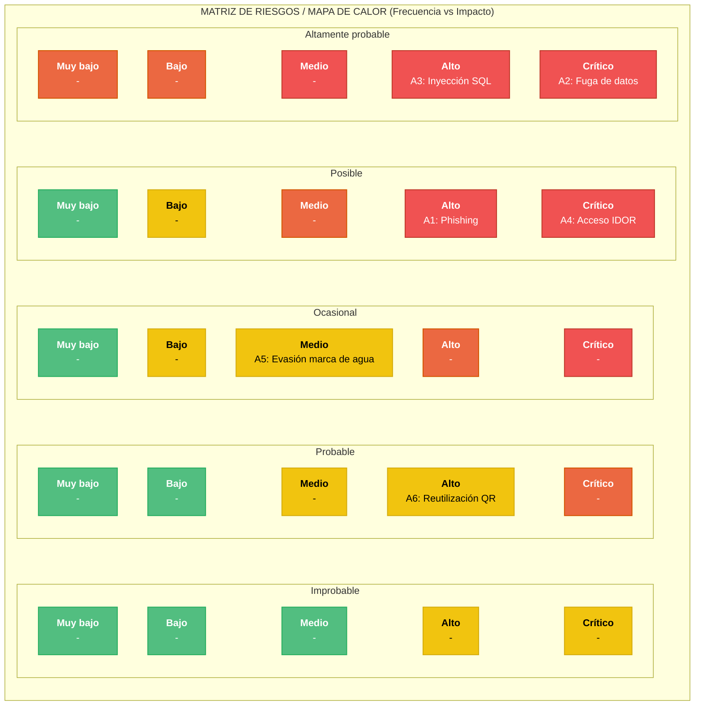
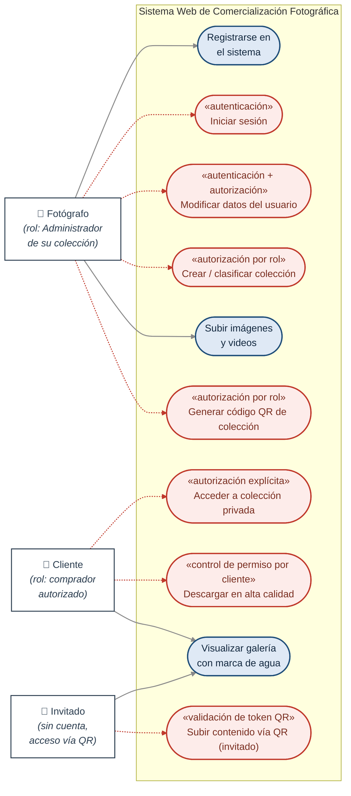

# Requerimientos de la Unidad Curricular: Ciberseguridad
**Proyecto de Egreso – BT 3° Tecnologías de la Información**
**Ana Victoria Reyes Macedo**

---

## Introduccion

Cada grupo deberá integrar aspectos teóricos y prácticos de ciberseguridad
dentro del desarrollo de su Proyecto de Egreso. Esta integración no será un componente
adicional, sino una dimensión transversal que debe estar presente desde la planificación
inicial hasta la implementación y evaluación final del sistema.

Será evaluado tanto el uso efectivo de herramientas profesionales, como la
documentación técnica, el análisis crítico, la aplicación de buenas prácticas y la
reflexión ética. Cada entrega parcial contará con una calificación específica, y su
contenido deberá integrarse dentro del documento general del proyecto, siguiendo el
formato establecido.

---

# Primera Entrega – Análisis y Diseño Seguro

## Objetivo: Detectar amenazas desde la etapa inicial del proyecto y proponer mecanismos preventivos adecuados.

## 1. Identificación de al menos 3 amenazas digitales relevantes.

1.1 Phishing dirigido a fotógrafos y clientes

El sistema almacena datos de contacto (correo y teléfono) y gestiona el acceso a colecciones privadas y a la descarga de material pagado a futuro. Un atacante podría suplantar al sistema o al fotógrafo mediante correos falsos (por ejemplo, notificaciones falsas de "nueva colección disponible" o "verificación de cuenta") para robar credenciales de acceso. Dado que el rol Fotógrafo administra colecciones privadas y autoriza clientes manualmente, el robo de sus credenciales comprometería la confidencialidad de todo su material y de los datos de sus clientes.

1.2 Inyección SQL 

El sistema cuenta con múltiples formularios que interactúan con la base de datos: registro de usuarios (RF1, RF2), inicio de sesión (RF3), creación de colecciones (RF4), carga de metadatos de imágenes/videos (RF7, RF20) y validación de códigos QR (RF13-RF17). Si estas entradas no se validan ni se usan consultas parametrizadas, un atacante podría inyectar código SQL para leer, modificar o eliminar datos de usuarios, colecciones o permisos de descarga, representando un riesgo crítico dado que la base de datos contiene cédulas y otros datos personales.

1.3 Fuga de datos personales

El RF1 exige registrar nombre completo, cédula, correo electrónico y teléfono tanto de fotógrafos como de clientes. Una fuga de esta base de datos (por configuración insegura del entorno en la nube, respaldo mal protegido o error humano) expondría información de identificación personal, lo que además de un daño reputacional para el proyecto implicaría un problema legal y ético para el equipo, dado que se trata de datos sensibles de terceros.

1.4 Acceso no autorizado a colecciones privadas (IDOR)

Según RF5 y RF6, las colecciones privadas solo deben ser visibles para los clientes que el fotógrafo autorizó explícitamente, y el sistema debe bloquear el acceso directo por URL. Si la autorización se valida únicamente en el frontend, o si los identificadores de colección son predecibles y no se verifica en el backend que el usuario autenticado tenga permiso sobre ese recurso específico (vulnerabilidad de tipo IDOR — Insecure Direct Object Reference), cualquier usuario podría acceder a material privado de otro cliente simplemente cambiando un identificador en la URL.

1.5 Evasión de la marca de agua y descarga no autorizada

El modelo de negocio del cliente depende de que las imágenes en vista previa tengan marca de agua y que solo el contenido autorizado se entregue sin ella (restricción técnica confirmada en la entrevista, RF9, RF11). Si el archivo de alta calidad queda accesible por una URL directa no protegida, o si la marca de agua se aplica solo de forma visual sin proteger el archivo original en el servidor, un usuario podría descargar el material sin haber sido autorizado, afectando directamente el objetivo de negocio del cliente (cobro ágil por el material).

1.6 Abuso o reutilización de códigos QR

El sistema usa códigos QR con dos propósitos distintos: acceso directo a una colección (RF16) y carga colaborativa de contenido por parte de invitados sin cuenta (RF13, RF14). Si estos códigos no expiran, no están vinculados a un evento/colección específica o pueden reutilizarse indefinidamente, un tercero que obtenga el QR (por ejemplo, fotografiándolo en un evento) podría subir contenido no deseado a la colección o acceder a material privado fuera del contexto para el que fue generado.

---

## 2. Mapa de Riesgos

El siguiente esquema vincula los componentes principales del sistema con las amenazas identificadas, permitiendo visualizar qué partes del sistema concentran mayor exposición.

 
*Rojo = Impacto Alto (técnico y a usuarios) · Naranja = Impacto Medio*
 
---
 
## Escala de valoración de riesgo
 
| Nivel | Probabilidad | Impacto | Resultado (R) | Acción Inmediata |
|---|---|---|---|---|
| **Crítico** | Muy Alta (4-5) | Catastrófico (4-5) | 16 - 25 | Detener operaciones / Mitigación urgente |
| **Alto** | Alta (3) | Mayor (3) | 9 - 15 | Planes de acción correctiva a corto plazo |
| **Medio** | Media (2) | Moderado (2) | 4 - 8 | Monitoreo periódico y controles programados |
| **Bajo** | Baja (1) | Menor (1) | 1 - 3 | Asumir el riesgo / Monitoreo mínimo |
 
*R = Probabilidad × Impacto*
 
---
 
## Amenazas identificadas — valoración aplicada
 
Tabla construida a partir de las conexiones reales del Mapa de Riesgos (componentes del sistema → amenazas detectadas).
 
| Amenaza | Componente(s) afectado(s) | Probabilidad | Impacto | R | Nivel | Acción Inmediata |
|---|---|---|---|---|---|---|
| Phishing dirigido a fotógrafos y clientes | Registro e inicio de sesión de usuarios | Alta (3) | Mayor (3) | 9 | **Alto** | Planes de acción correctiva a corto plazo |
| Fuga de datos personales (cédula, contacto) | Base de datos de usuarios | Media (2) | Catastrófico (5) | 10 | **Alto** | Planes de acción correctiva a corto plazo |
| Inyección SQL en formularios y filtros | Base de datos de usuarios · Carga de imágenes y videos | Media (2) | Catastrófico (5) | 10 | **Alto** | Planes de acción correctiva a corto plazo |
| Acceso no autorizado a colecciones privadas (IDOR) | Gestión de colecciones · Acceso y carga vía código QR | Alta (3) | Mayor (3) | 9 | **Alto** | Planes de acción correctiva a corto plazo |
| Evasión de marca de agua / descarga no autorizada | Vista previa con marca de agua | Alta (3) | Moderado (2) | 6 | **Medio** | Monitoreo periódico y controles programados |
| Abuso o reutilización de códigos QR | Acceso y carga vía código QR | Media (2) | Moderado (2) | 4 | **Medio** | Monitoreo periódico y controles programados |

---
 
### Notas de justificación
 
- **Fuga de datos personales** e **Inyección SQL** se clasifican como Alto por su impacto catastrófico: ambas comprometen directamente la base de datos de usuarios, que contiene cédula, correo y teléfono reales de fotógrafos y clientes.
- **Phishing** se clasifica como Alto por su alta probabilidad: es el vector de ataque más simple de ejecutar contra el punto de registro/inicio de sesión, sin requerir explotar una falla técnica del sistema.
- **Acceso no autorizado a colecciones privadas (IDOR)** se clasifica como Alto porque dos componentes distintos convergen en esta amenaza (Gestión de colecciones y Acceso vía QR), lo que aumenta su probabilidad de ocurrencia.
- **Evasión de marca de agua** y **Abuso de código QR** quedan en Medio: su impacto afecta principalmente el modelo de negocio del fotógrafo, pero su explotación depende de condiciones más puntuales (acceso al archivo original o al QR físico).

---
 
## Análisis de impacto (técnico y sobre los usuarios)
 
| Amenaza | Impacto técnico | Impacto sobre los usuarios |
|---|---|---|
| Phishing dirigido a fotógrafos y clientes | Robo de credenciales; compromiso de cuentas de Fotógrafo o Cliente | Suplantación de identidad; pérdida de confianza en la plataforma |
| Fuga de datos personales (cédula, contacto) | Pérdida de confidencialidad del almacenamiento en la nube | Exposición de cédula, correo y teléfono de usuarios reales |
| Inyección SQL en formularios y filtros | Alteración o destrucción de datos; posible caída del servicio | Exposición de datos personales de todos los usuarios registrados |
| Acceso no autorizado a colecciones privadas (IDOR) | Bypass de la lógica de autorización del backend | Exposición de material privado de clientes y eventos ajenos |
| Evasión de marca de agua / descarga no autorizada | Acceso directo al archivo original sin control de permisos | Pérdida económica para el fotógrafo (afecta el objetivo de negocio) |
| Abuso o reutilización de códigos QR | Carga de contenido no controlado; acceso fuera del contexto previsto | Contenido indebido en la colección; exposición no deseada de material |

---

## 3. Seguridad en los Diagramas de Casos de Uso

El siguiente diagrama incorpora explícitamente los roles del sistema (Fotógrafo, Cliente e Invitado), sus niveles de acceso, y las medidas de control que protegen los casos de uso más sensibles y una diferenciación visual de los casos de uso que requieren un control de seguridad.

---

## a. Roles del sistema y niveles de acceso.

* Fotógrafo: rol con mayor nivel de privilegio sobre su propio contenido. Administra sus colecciones (públicas o privadas), autoriza clientes de forma explícita, genera códigos QR y habilita o revoca el permiso de descarga en alta calidad (RF12). No tiene acceso a colecciones de otros fotógrafos.
* Cliente: rol autenticado con acceso restringido a las colecciones donde fue autorizado explícitamente por un fotógrafo (RF5). Solo puede descargar en alta calidad si ese permiso fue habilitado específicamente para él.
* Invitado: rol sin cuenta, con el nivel de acceso más bajo. Su participación se limita a lo habilitado por un código QR de un evento puntual, con permisos acotados (por ejemplo, subir contenido) y sin acceso administrativo a la colección.

---

## b. Medidas de control en casos de uso sensibles

* Iniciar sesión — requiere autenticación (usuario/contraseña con hash seguro) antes de habilitar cualquier otra funcionalidad.
* Modificar datos del usuario — requiere autenticación y autorización de propietario: el backend debe verificar que el usuario autenticado sea el dueño del perfil que intenta modificar.
* Crear / clasificar colección y Generar código QR de colección — requieren verificar que el usuario autenticado tenga el rol Fotógrafo antes de exponer la funcionalidad, tanto en la interfaz como en el backend.
* Acceder a colección privada — requiere autorización explícita: el backend valida, para cada solicitud, si el cliente autenticado figura en la lista de autorizados de esa colección específica (mitiga el riesgo de IDOR descrito en 1.4).
* Descargar en alta calidad — requiere verificar el permiso individual habilitado por el fotógrafo para ese cliente en esa colección (RF12), no solo la pertenencia a la colección.
* Subir contenido vía QR (invitado) — requiere validar que el token/código QR esté vigente y vinculado a la colección/evento correspondiente antes de aceptar la carga (mitiga el riesgo de abuso de QR descrito en 1.6).

---

## 4. Buenas prácticas de seguridad en desarrollo web

Resumen las buenas prácticas durante el desarrollo, seleccionadas y justificadas en función de las amenazas concretas identificadas para este proyecto.

## 4.1 Validación y saneamiento de entradas

Todo dato ingresado por el usuario (formularios de registro, título/descripción de imágenes, parámetros de búsqueda) se validará y saneará tanto en el frontend como en el backend, y las consultas a la base de datos se realizarán mediante sentencias parametrizadas u ORM, nunca concatenando texto. Esta práctica ataca directamente el riesgo de inyección SQL (1.2) descrito arriba, que es crítico por la cantidad de formularios con los que cuenta el sistema.

---

## 4.2 Autenticación robusta y gestión segura de sesiones

Las contraseñas se almacenarán con un algoritmo de hash con salting (por ejemplo bcrypt o Argon2), nunca en texto plano ni con hashes reversibles. Las sesiones utilizarán tokens con expiración y se invalidarán al cerrar sesión. Esta práctica reduce el impacto de un eventual phishing (1.1), ya que aunque se filtre un correo o usuario, la contraseña no queda expuesta directamente en la base de datos.

---

## 4.3 Control de acceso verificado en el backend (no solo en la interfaz)

Cada endpoint que devuelve una colección, imagen o dato de usuario deberá verificar en el servidor que el solicitante tiene permiso sobre ese recurso puntual, usando identificadores no predecibles (UUID en lugar de IDs incrementales) para colecciones privadas. Esta práctica es la respuesta directa al riesgo de acceso no autorizado / IDOR (1.4), y es coherente con el requerimiento RF6 del proyecto.

---

## 4.4 Protección del archivo original frente a la vista previa

El archivo en alta calidad no se expondrá en ninguna ruta pública ni predecible: se servirá únicamente a través de un endpoint que valide el permiso de descarga del cliente en el momento de la solicitud (RF11, RF12), mientras que la vista previa con marca de agua se generará como una copia separada y optimizada (RF8, RF9). Esto protege el objetivo de negocio del cliente frente a la evasión de marca de agua (1.5).

---

## 4.5 Códigos QR con expiración y alcance limitado

Cada código QR se generará como un token único asociado a una colección o evento específico, con fecha de expiración y con permisos acotados según su propósito (solo carga, para invitados; o solo visualización/descarga, según RF16 y RF17). Esta práctica limita el riesgo de abuso o reutilización de QR (1.6) identificado para las funcionalidades colaborativas del sistema.

---

## 4.6 Cifrado de datos en tránsito y protección de datos personales en reposo

Toda comunicación entre cliente y servidor se realizará bajo HTTPS/TLS, incluso en el entorno de pruebas local. Los campos más sensibles de la base de datos (cédula, teléfono) se tratarán con acceso restringido por rol de aplicación, y se aplicarán respaldos automáticos diarios con rotación de las últimas tres copias, tal como ya fue definido por el equipo en los requerimientos no funcionales RNF5, RNF6 y RNF7 del documento de planificación. Esta práctica reduce el impacto de una eventual fuga de datos (1.3).

---

## 4.7 Registro y monitoreo de eventos sensibles

Se registrarán eventos como inicios de sesión fallidos, cambios de permisos de descarga y generación/uso de códigos QR, lo que permitirá detectar patrones de abuso (por ejemplo, múltiples intentos de acceso a colecciones privadas) y respalda además el requerimiento funcional RF22 de historial de descargas, reutilizando la misma infraestructura de auditoría para fines de seguridad y de negocio.

