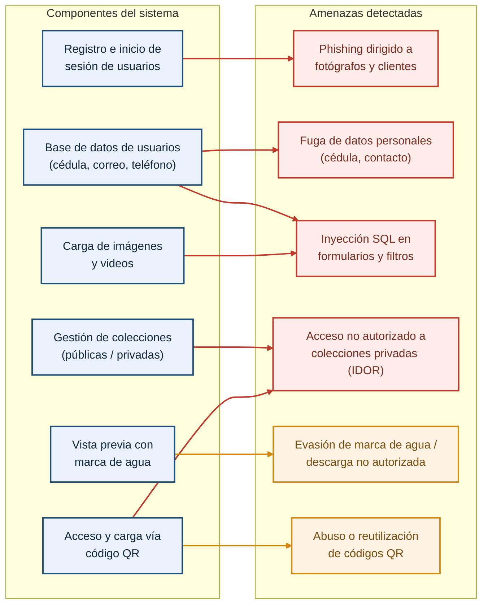

# Requerimientos de la Unidad Curricular: Ciberseguridad
**Proyecto de Egreso – BT 3° Tecnologías de la Información**
**Ana Victoria Reyes Macedo**

---

## Introduccion

Cada grupo deberá integrar aspectos teóricos y prácticos de ciberseguridad
dentro del desarrollo de su Proyecto de Egreso. Esta integración no será un componente
adicional, sino una dimensión transversal que debe estar presente desde la planificación
inicial hasta la implementación y evaluación final del sistema.

Será evaluado tanto el uso efectivo de herramientas profesionales, como la
documentación técnica, el análisis crítico, la aplicación de buenas prácticas y la
reflexión ética. Cada entrega parcial contará con una calificación específica, y su
contenido deberá integrarse dentro del documento general del proyecto, siguiendo el
formato establecido.

---

# Primera Entrega – Análisis y Diseño Seguro

## Objetivo: Detectar amenazas desde la etapa inicial del proyecto y proponer mecanismos preventivos adecuados.

## 1. Identificación de al menos 3 amenazas digitales relevantes.

1.1 Phishing dirigido a fotógrafos y clientes
El sistema almacena datos de contacto (correo y teléfono) y gestiona el acceso a colecciones privadas y a la descarga de material pagado a futuro. Un atacante podría suplantar al sistema o al fotógrafo mediante correos falsos (por ejemplo, notificaciones falsas de "nueva colección disponible" o "verificación de cuenta") para robar credenciales de acceso. Dado que el rol Fotógrafo administra colecciones privadas y autoriza clientes manualmente, el robo de sus credenciales comprometería la confidencialidad de todo su material y de los datos de sus clientes.

1.2 Inyección SQL 
El sistema cuenta con múltiples formularios que interactúan con la base de datos: registro de usuarios (RF1, RF2), inicio de sesión (RF3), creación de colecciones (RF4), carga de metadatos de imágenes/videos (RF7, RF20) y validación de códigos QR (RF13-RF17). Si estas entradas no se validan ni se usan consultas parametrizadas, un atacante podría inyectar código SQL para leer, modificar o eliminar datos de usuarios, colecciones o permisos de descarga, representando un riesgo crítico dado que la base de datos contiene cédulas y otros datos personales.

1.3 Fuga de datos personales
El RF1 exige registrar nombre completo, cédula, correo electrónico y teléfono tanto de fotógrafos como de clientes. Una fuga de esta base de datos (por configuración insegura del entorno en la nube, respaldo mal protegido o error humano) expondría información de identificación personal, lo que además de un daño reputacional para el proyecto implicaría un problema legal y ético para el equipo, dado que se trata de datos sensibles de terceros.

1.4 Acceso no autorizado a colecciones privadas 
Según RF5 y RF6, las colecciones privadas solo deben ser visibles para los clientes que el fotógrafo autorizó explícitamente, y el sistema debe bloquear el acceso directo por URL. Si la autorización se valida únicamente en el frontend, o si los identificadores de colección son predecibles y no se verifica en el backend que el usuario autenticado tenga permiso sobre ese recurso específico (vulnerabilidad de tipo IDOR — Insecure Direct Object Reference), cualquier usuario podría acceder a material privado de otro cliente simplemente cambiando un identificador en la URL.

1.5 Evasión de la marca de agua y descarga no autorizada
El modelo de negocio del cliente depende de que las imágenes en vista previa tengan marca de agua y que solo el contenido autorizado se entregue sin ella (restricción técnica confirmada en la entrevista, RF9, RF11). Si el archivo de alta calidad queda accesible por una URL directa no protegida, o si la marca de agua se aplica solo de forma visual sin proteger el archivo original en el servidor, un usuario podría descargar el material sin haber sido autorizado, afectando directamente el objetivo de negocio del cliente (cobro ágil por el material).

1.6 Abuso o reutilización de códigos QR
El sistema usa códigos QR con dos propósitos distintos: acceso directo a una colección (RF16) y carga colaborativa de contenido por parte de invitados sin cuenta (RF13, RF14). Si estos códigos no expiran, no están vinculados a un evento/colección específica o pueden reutilizarse indefinidamente, un tercero que obtenga el QR (por ejemplo, fotografiándolo en un evento) podría subir contenido no deseado a la colección o acceder a material privado fuera del contexto para el que fue generado.

---

## 2. Mapa de Riesgos

El siguiente esquema vincula los componentes principales del sistema con las amenazas identificadas, permitiendo visualizar qué partes del sistema concentran mayor exposición.

 
*Rojo = Impacto Alto (técnico y a usuarios) · Naranja = Impacto Medio*
 
---
 
## Escala de valoración de riesgo
 
| Nivel | Probabilidad | Impacto | Resultado (R) | Acción Inmediata |
|---|---|---|---|---|
| **Crítico** | Muy Alta (4-5) | Catastrófico (4-5) | 16 - 25 | Detener operaciones / Mitigación urgente |
| **Alto** | Alta (3) | Mayor (3) | 9 - 15 | Planes de acción correctiva a corto plazo |
| **Medio** | Media (2) | Moderado (2) | 4 - 8 | Monitoreo periódico y controles programados |
| **Bajo** | Baja (1) | Menor (1) | 1 - 3 | Asumir el riesgo / Monitoreo mínimo |
 
*R = Probabilidad × Impacto*
 
---
 
## Amenazas identificadas — valoración aplicada
 
Tabla construida a partir de las conexiones reales del Mapa de Riesgos (componentes del sistema → amenazas detectadas).
 
| Amenaza | Componente(s) afectado(s) | Probabilidad | Impacto | R | Nivel | Acción Inmediata |
|---|---|---|---|---|---|---|
| Phishing dirigido a fotógrafos y clientes | Registro e inicio de sesión de usuarios | Alta (3) | Mayor (3) | 9 | **Alto** | Planes de acción correctiva a corto plazo |
| Fuga de datos personales (cédula, contacto) | Base de datos de usuarios | Media (2) | Catastrófico (5) | 10 | **Alto** | Planes de acción correctiva a corto plazo |
| Inyección SQL en formularios y filtros | Base de datos de usuarios · Carga de imágenes y videos | Media (2) | Catastrófico (5) | 10 | **Alto** | Planes de acción correctiva a corto plazo |
| Acceso no autorizado a colecciones privadas (IDOR) | Gestión de colecciones · Acceso y carga vía código QR | Alta (3) | Mayor (3) | 9 | **Alto** | Planes de acción correctiva a corto plazo |
| Evasión de marca de agua / descarga no autorizada | Vista previa con marca de agua | Alta (3) | Moderado (2) | 6 | **Medio** | Monitoreo periódico y controles programados |
| Abuso o reutilización de códigos QR | Acceso y carga vía código QR | Media (2) | Moderado (2) | 4 | **Medio** | Monitoreo periódico y controles programados |

