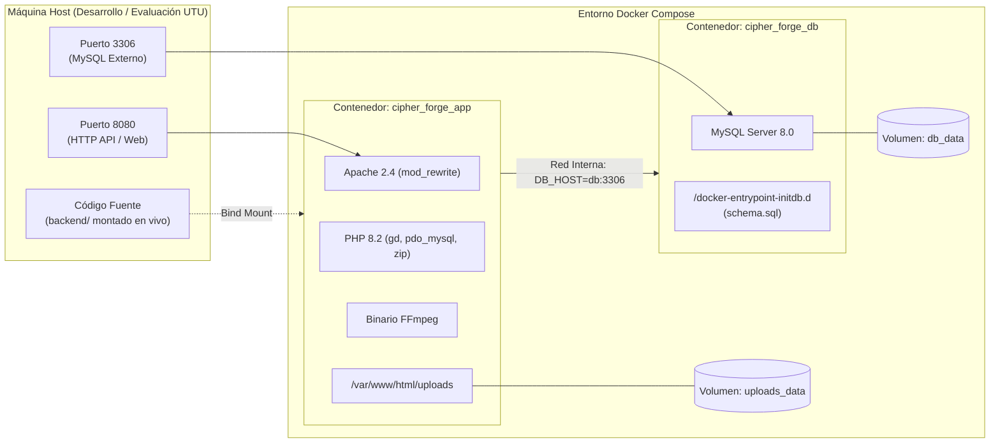

# Documentación de Infraestructura y Contenedores

Este documento detalla la arquitectura de infraestructura local basada en contenedores Docker para el proyecto **Cipher_Forge**, describiendo la configuración del servidor web, entorno de ejecución PHP, base de datos MySQL y la persistencia de datos.

---

## 1. Visión General de la Infraestructura

La infraestructura se define mediante dos archivos principales ubicados en `backend/`:
1. `Dockerfile`: Define la imagen personalizada del entorno de backend (Apache + PHP 8.2 + FFmpeg + Extensiones compiladas).
2. `docker-compose.yml`: Orquesta los servicios de aplicación y base de datos, configurando puertos, redes internas y volúmenes persistentes.



---

## 2. Especificación del Dockerfile (`backend/Dockerfile`)

<!-- WHAT: Archivo de construcción de la imagen de aplicación PHP 8.2 con Apache -->
<!-- WHY: Empaqueta códecs de video, librerías gráficas y extensiones de base de datos sin contaminar el SO del host -->
<!-- HOW: Basado en Debian Buster/Bullseye vía imagen oficial php:8.2-apache -->

> **Nota de trazabilidad:** Los detalles de FFmpeg, Docker y Filesystem de esta sección implementan la épica EP4 de 01-requerimientos.md, que quedó redactada en forma general a propósito por CC-08. Ver 01-requerimientos.md EP4 y 02-modelado.md Capa de Almacenamiento.

### 2.1 Código y Desglose Línea por Línea

```dockerfile
# 1. Imagen base oficial con PHP 8.2 y servidor web Apache sobre Debian Linux
FROM php:8.2-apache

# 2. Instalación de paquetes del sistema operativo:
#    - ffmpeg: binario CLI para recortes y transcodificación de videos de hasta 800MB (RF26)
#    - libpng-dev, libjpeg-dev, libfreetype6-dev: cabeceras C para soporte de fuentes y renderizado de imágenes en GD
#    - libzip-dev, zip, unzip: utilidades para manipulación de archivos comprimidos
RUN apt-get update && apt-get install -y \
    ffmpeg \
    libpng-dev \
    libjpeg-dev \
    libfreetype6-dev \
    libzip-dev \
    zip \
    unzip \
    && apt-get clean \
    && rm -rf /var/lib/apt/lists/*

# 3. Configuración y compilación de la extensión GD con soporte FreeType y JPEG (impresión de marca de agua en RF9)
#    Instalación concurrente (-j) de extensiones nativas: GD, pdo_mysql (acceso a BD) y zip
RUN docker-php-ext-configure gd --with-freetype --with-jpeg \
    && docker-php-ext-install -j$(nproc) gd pdo_mysql zip

# 4. Habilitación del módulo mod_rewrite de Apache para soportar enrutamiento Front Controller (index.php)
RUN a2enmod rewrite

# 5. Directorio de trabajo predeterminado dentro del contenedor
WORKDIR /var/www/html
```

---

## 3. Especificación de Docker Compose (`backend/docker-compose.yml`)

Docker Compose orquesta dos servicios desacoplados comunicados mediante una red interna tipo puente (`bridge`).

### 3.1 Servicios Definidos

#### A. Servicio `app` (Contenedor `cipher_forge_app`)
* **Construcción:** Construye la imagen local utilizando el archivo `./Dockerfile`.
* **Mapeo de Puertos:** `8080:80` (el puerto 80 del servidor Apache interno se expone en el puerto 8080 del host local).
* **Volúmenes:**
  * `.:/var/www/html`: Montaje enlazado (*bind mount*) que sincroniza en tiempo real los cambios de código fuente sin necesidad de reconstruir la imagen.
  * `uploads_data:/var/www/html/uploads`: Volumen gestionado por Docker para almacenar de forma persistente los archivos multimedia originales y previsualizaciones, evitando que se pierdan al reiniciar contenedores.
* **Variables de Entorno:**
  * `DB_HOST=db`: Resuelve dinámicamente la IP del contenedor de base de datos a través del DNS interno de Docker.
  * `DB_NAME=cipher_forge`: Nombre del esquema de base de datos.
  * `DB_USER=cipher_user` / `DB_PASS=cipher_password`: Credenciales del usuario de la aplicación.
  * `DB_PORT=3306`: Puerto estándar de escucha de MySQL.
* **Dependencias:** `depends_on: [db]` garantiza que el contenedor de base de datos inicie antes de la aplicación.

#### B. Servicio `db` (Contenedor `cipher_forge_db`)
* **Imagen:** Imagen oficial `mysql:8.0`.
* **Mapeo de Puertos:** `3306:3306` (permite conexiones externas de diagnóstico mediante clientes como DBeaver, MySQL Workbench o la extensión de VS Code).
* **Variables de Entorno:**
  * `MYSQL_ROOT_PASSWORD=root_password`: Contraseña administrativa de MySQL.
  * `MYSQL_DATABASE=cipher_forge`: Creación automática de la base de datos al inicializar el contenedor.
  * `MYSQL_USER=cipher_user` / `MYSQL_PASSWORD=cipher_password`: Usuario no privilegiado asignado a la aplicación.
* **Volúmenes:**
  * `db_data:/var/lib/mysql`: Persistencia física de los archivos de tablas y datos de MySQL.
  * `./database/schema.sql:/docker-entrypoint-initdb.d/schema.sql`: Montaje del script SQL de inicialización. MySQL lo ejecuta automáticamente la primera vez que se crea el volumen de datos.

---

## 4. Scripts y Mecanismos de Persistencia

### 4.1 Script de Esquema de Datos (`backend/database/schema.sql`)
Define la estructura DDL para las 11 entidades del sistema:
- Creación condicional del esquema: `CREATE DATABASE IF NOT EXISTS cipher_forge;`
- Creación de tablas maestras e hijas con claves foráneas e integridad referencial (`ON DELETE CASCADE`).
- Índices únicos sobre correos electrónicos (`email`), nombres de hashtags y tokens QR.

### 4.2 Mecanismo de Respaldo Diario y Rotación (RNF5, RNF6, RNF7)

Para satisfacer los requerimientos no funcionales de respaldo diario de la base de datos conservando las últimas 3 copias de forma persistente y portable, el sistema prescinde de scripts bash externos o dependencias del sistema operativo host. En su lugar, implementa una solución autocontenida y desacoplada en PHP nativo mediante `App\services\BackupService`, orquestada por el script de consola `backend/cron-backup.php` o invocable vía API REST mediante `POST /sistema/backup`.

> **Nota de trazabilidad:** Este mecanismo implementa el RF15 generalizado y el HU12 simplificado aprobados en CC-08 y CC-10. En requerimientos solo queda aprobar el material y eliminar lo no aprobado tras 24 horas. El detalle de tarea programada vive aquí, no en 01-requerimientos.md.

Todos los archivos de volcado se almacenan físicamente en el directorio del proyecto:
`backend/backups/` con la nomenclatura `backup_cipher_forge_{YYYY-MM-DD_HH-mm-ss}.sql`.

#### Componentes de la Arquitectura de Respaldo

1. **Directorio de Persistencia (`backend/backups/`):**
   - Aloja los volcados SQL generados por el sistema.
   - Es resuelto dinámicamente mediante la clase de configuración (`App\Core\Config::backupsDir()`).

2. **Servicio Nuclear de Respaldo (`backend/src/services/BackupService.php`):**
   - **Extracción de Esquema y Datos con PDO:** Consulta la base de datos mediante `SHOW FULL TABLES WHERE Table_type = 'BASE TABLE'`, extrae la estructura DDL con `SHOW CREATE TABLE` y vuelca los registros DML con sentencias SQL preparadas y entrecomillado seguro (`$pdo->quote()`).
   - **Aislamiento de la tabla de auditoría:** Excluye deliberadamente la tabla `backups` durante el volcado para evitar referencias circulares o inconsistencias de estado.
   - **Rotación automática FIFO (RNF6):** Consulta los registros existentes en la tabla `backups` ordenados por `fecha_backup ASC`. Cuando se alcanzan 3 o más copias, calcula los excedentes y elimina tanto el archivo físico en `backend/backups/` (`unlink()`) como su fila correspondiente en la base de datos (`DELETE FROM backups WHERE id_backup = :id`) antes de registrar el nuevo volcado.
   - **Registro de auditoría (RNF7):** Inserta en la tabla `backups` la ruta relativa (`backups/backup_cipher_forge_...sql`), el nombre del archivo y la marca de tiempo exacta (`NOW()`).

3. **Script CLI de Mantenimiento Automatizado (`backend/cron-backup.php`):**

```php
<?php
// WHAT: Script CLI ejecutable para tareas programadas de mantenimiento y respaldo de base de datos.
// WHY: Automatiza el cumplimiento de RNF5, RNF6, RNF7 y la purga colaborativa (RF15) sin intervención manual ni dependencias del host.
// HOW: Inicializa el autoloader PSR-4 nativo, ejecuta BackupService con rotación en backend/backups/ y purga archivos expirados.

declare(strict_types=1);

require_once __DIR__ . '/public/index.php'; // Carga autoloader de clases

use App\services\BackupService;
use App\services\MultimediaService;

echo "[" . date('Y-m-d H:i:s') . "] Iniciando tareas programadas de mantenimiento...\n";

try {
    // 1. Respaldo de base de datos con rotación (HU13 / RNF5, RNF6, RNF7)
    $backupService = new BackupService();
    $backup = $backupService->generarBackup();
    echo "[OK] Respaldo generado en backend/backups/: {$backup['nombre_backup']} ({$backup['tamanio_kb']} KB)\n";

    // 2. Limpieza de archivos colaborativos no aprobados con más de 24h (HU12 / RF15)
    $multimediaService = new MultimediaService();
    $purgados = $multimediaService->purgarExpirados();
    echo "[OK] Archivos colaborativos expirados purgados: {$purgados}\n";

    echo "[" . date('Y-m-d H:i:s') . "] Tareas finalizadas exitosamente.\n";
    exit(0);
} catch (Throwable $e) {
    echo "[ERROR] Fallo en tareas programadas: " . $e->getMessage() . "\n";
    exit(1);
}
```

4. **Endpoints de Control vía API REST (`backend/routes.php`):**
   - `POST /sistema/backup`: Permite disparar manualmente el proceso de respaldo y rotación desde el panel administrativo o herramientas de prueba, retornando el estado y tamaño del archivo en formato JSON.
   - `GET /sistema/backups`: Retorna el historial de los respaldos vigentes registrados en la tabla `backups`.
