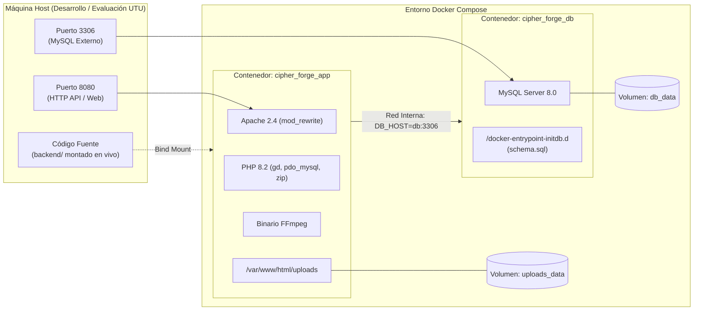

# Documentación de Infraestructura y Contenedores

Este documento detalla la arquitectura de infraestructura local basada en contenedores Docker para el proyecto **Cipher_Forge**, describiendo la configuración del servidor web, entorno de ejecución PHP, base de datos MySQL y la persistencia de datos.

---

## 1. Visión General de la Infraestructura

La infraestructura se define mediante dos archivos principales ubicados en `backend/`:
1. `Dockerfile`: Define la imagen personalizada del entorno de backend (Apache + PHP 8.2 + FFmpeg + Extensiones compiladas).
2. `docker-compose.yml`: Orquesta los servicios de aplicación y base de datos, configurando puertos, redes internas y volúmenes persistentes.



---

## 2. Especificación del Dockerfile (`backend/Dockerfile`)

<!-- WHAT: Archivo de construcción de la imagen de aplicación PHP 8.2 con Apache -->
<!-- WHY: Empaqueta códecs de video, librerías gráficas y extensiones de base de datos sin contaminar el SO del host -->
<!-- HOW: Basado en Debian Buster/Bullseye vía imagen oficial php:8.2-apache -->

### 2.1 Código y Desglose Línea por Línea

```dockerfile
# 1. Imagen base oficial con PHP 8.2 y servidor web Apache sobre Debian Linux
FROM php:8.2-apache

# 2. Instalación de paquetes del sistema operativo:
#    - ffmpeg: binario CLI para recortes y transcodificación de videos de hasta 800MB (RF26)
#    - libpng-dev, libjpeg-dev, libfreetype6-dev: cabeceras C para soporte de fuentes y renderizado de imágenes en GD
#    - libzip-dev, zip, unzip: utilidades para manipulación de archivos comprimidos
RUN apt-get update && apt-get install -y \
    ffmpeg \
    libpng-dev \
    libjpeg-dev \
    libfreetype6-dev \
    libzip-dev \
    zip \
    unzip \
    && apt-get clean \
    && rm -rf /var/lib/apt/lists/*

# 3. Configuración y compilación de la extensión GD con soporte FreeType y JPEG (impresión de marca de agua en RF9)
#    Instalación concurrente (-j) de extensiones nativas: GD, pdo_mysql (acceso a BD) y zip
RUN docker-php-ext-configure gd --with-freetype --with-jpeg \
    && docker-php-ext-install -j$(nproc) gd pdo_mysql zip

# 4. Habilitación del módulo mod_rewrite de Apache para soportar enrutamiento Front Controller (index.php)
RUN a2enmod rewrite

# 5. Directorio de trabajo predeterminado dentro del contenedor
WORKDIR /var/www/html
```

---

## 3. Especificación de Docker Compose (`backend/docker-compose.yml`)

Docker Compose orquesta dos servicios desacoplados comunicados mediante una red interna tipo puente (`bridge`).

### 3.1 Servicios Definidos

#### A. Servicio `app` (Contenedor `cipher_forge_app`)
* **Construcción:** Construye la imagen local utilizando el archivo `./Dockerfile`.
* **Mapeo de Puertos:** `8080:80` (el puerto 80 del servidor Apache interno se expone en el puerto 8080 del host local).
* **Volúmenes:**
  * `.:/var/www/html`: Montaje enlazado (*bind mount*) que sincroniza en tiempo real los cambios de código fuente sin necesidad de reconstruir la imagen.
  * `uploads_data:/var/www/html/uploads`: Volumen gestionado por Docker para almacenar de forma persistente los archivos multimedia originales y previsualizaciones, evitando que se pierdan al reiniciar contenedores.
* **Variables de Entorno:**
  * `DB_HOST=db`: Resuelve dinámicamente la IP del contenedor de base de datos a través del DNS interno de Docker.
  * `DB_NAME=cipher_forge`: Nombre del esquema de base de datos.
  * `DB_USER=cipher_user` / `DB_PASS=cipher_password`: Credenciales del usuario de la aplicación.
  * `DB_PORT=3306`: Puerto estándar de escucha de MySQL.
* **Dependencias:** `depends_on: [db]` garantiza que el contenedor de base de datos inicie antes de la aplicación.

#### B. Servicio `db` (Contenedor `cipher_forge_db`)
* **Imagen:** Imagen oficial `mysql:8.0`.
* **Mapeo de Puertos:** `3306:3306` (permite conexiones externas de diagnóstico mediante clientes como DBeaver, MySQL Workbench o la extensión de VS Code).
* **Variables de Entorno:**
  * `MYSQL_ROOT_PASSWORD=root_password`: Contraseña administrativa de MySQL.
  * `MYSQL_DATABASE=cipher_forge`: Creación automática de la base de datos al inicializar el contenedor.
  * `MYSQL_USER=cipher_user` / `MYSQL_PASSWORD=cipher_password`: Usuario no privilegiado asignado a la aplicación.
* **Volúmenes:**
  * `db_data:/var/lib/mysql`: Persistencia física de los archivos de tablas y datos de MySQL.
  * `./database/schema.sql:/docker-entrypoint-initdb.d/schema.sql`: Montaje del script SQL de inicialización. MySQL lo ejecuta automáticamente la primera vez que se crea el volumen de datos.

---

## 4. Scripts y Mecanismos de Persistencia

### 4.1 Script de Esquema de Datos (`backend/database/schema.sql`)
Define la estructura DDL para las 11 entidades del sistema:
- Creación condicional del esquema: `CREATE DATABASE IF NOT EXISTS cipher_forge;`
- Creación de tablas maestras e hijas con claves foráneas e integridad referencial (`ON DELETE CASCADE`).
- Índices únicos sobre correos electrónicos (`email`), nombres de hashtags y tokens QR.

### 4.2 Mecanismo de Respaldo Diario y Rotación (RNF5, RNF6, RNF7)
Para satisfacer los requerimientos no funcionales de respaldo diario de la base de datos conservando las últimas 3 copias, el sistema utiliza el binario `mysqldump` ejecutado sobre el contenedor `cipher_forge_db`.

**Script de Respaldo (`scripts/backup_db.sh`):**
```bash
#!/bin/bash
# WHAT: Genera un volcado diario de la BD y elimina respaldos que superen el límite de 3 copias
# WHY: Cumple con RNF5, RNF6 y RNF7 para prevención de pérdida de información
# HOW: Ejecuta mysqldump dentro del contenedor y rota mediante ordenamiento cronológico

TIMESTAMP=$(date +"%Y%m%d_%H%M%S")
BACKUP_DIR="./backups"
BACKUP_FILE="${BACKUP_DIR}/cipher_forge_${TIMESTAMP}.sql"

mkdir -p "${BACKUP_DIR}"

# 1. Generar volcado con mysqldump
docker exec cipher_forge_db mysqldump -u cipher_user -pcipher_password cipher_forge > "${BACKUP_FILE}"

# 2. Registrar metadatos en la tabla backups (RNF7)
docker exec -i cipher_forge_db mysql -u cipher_user -pcipher_password cipher_forge <<EOF
INSERT INTO backups (ruta_backup, nombre_backup, fecha_backup) 
VALUES ('${BACKUP_FILE}', 'cipher_forge_${TIMESTAMP}.sql', NOW());
EOF

# 3. Rotación: mantener únicamente las 3 copias más recientes (RNF6)
ls -1tr ${BACKUP_DIR}/cipher_forge_*.sql | head -n -3 | xargs -r rm --
```
